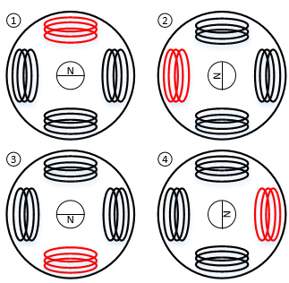
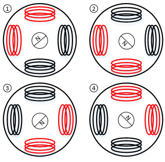
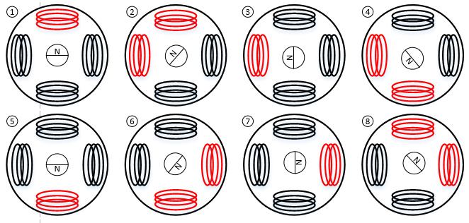
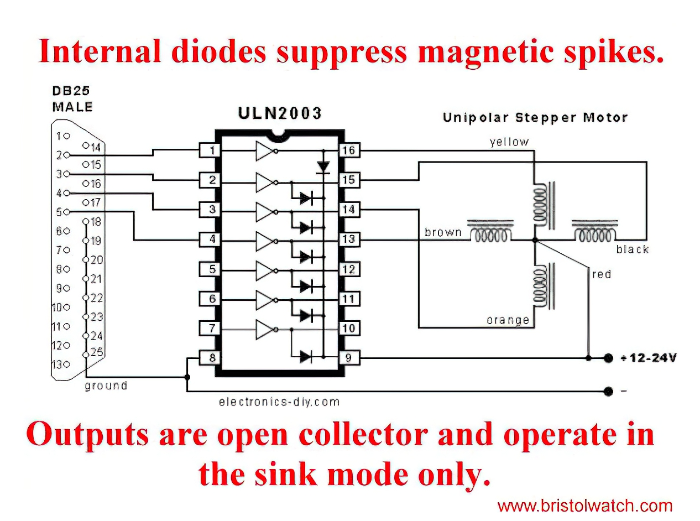
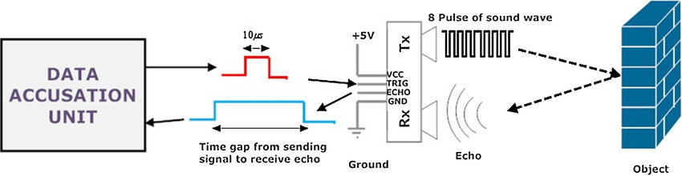
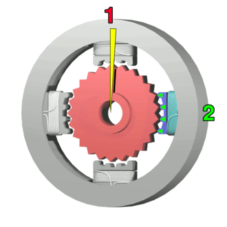

# 單晶片lab05結報
###### tags: `arduino`
###### 實驗日期 : 2021/10/21
## 上課教材
- [超音波、步進馬達](https://hackmd.io/@us4sw9duT5aIGbNJpCM_-Q/r1cFVAulY)

## lab1
### SPEC
使用超聲波模組搭配LCD顯示器與LED燈。
|物體距離(cm)|LCD第2行顯示|
|:-:|:-:|
|$d < 20$|`Distance : xx cm`|
|$d > 20$|`Out of Distance`|

- LCD第1行顯示`{自己學號}`。
- LED隨距離越近閃爍越快，`5cm`以下恆亮。

### 實現方法
```cpp
pinMode(trigPin, OUTPUT);
pinMode(echoPin, INPUT);
```
定義`trig`為輸出，也就是MCU輸出並傳給超聲波模組`HC-SR04`的訊號；定義`echo`為輸入，也就是超聲波模組`HC-SR04`輸出傳給MCU接收的訊號。
```cpp
digitalWrite(trigPin, LOW);
delayMicroseconds(5);
digitalWrite(trigPin, HIGH);
delayMicroseconds(10);
digitalWrite(trigPin, LOW);
```
給`Trig`高電位，持續`10`微秒。
```cpp
duration = pulseIn(echoPin, HIGH);
```
參見[Arduino官方doc](https://www.arduino.cc/en/Reference.PulseIn)，讀入`echo`腳位，如上值函數參數為`HIGH`，意思是當訊號`HIGH`時開始計時，等到回到`LOW`時，則回傳這段以`microseconds`($\mu s$)為單位的脈衝的時間長度。

接下來是物理計算，令溫度為$20^{\circ}\text{C}$，換算為距離，最後再由LCD顯示。
$$\text{distance} = \frac{\text{echo time }(\mu s)}{2} \times (331.5 + 0.607 \times 20)(\frac{100}{10^6} \;\frac{\text{cm}}{\text{ms}})$$

## lab2
### SPEC
使用超聲波模組搭配步進馬達。
|物體距離(cm)|馬達運動|
|:-:|:-:|
|$d < 10$|順時針旋轉|
|$d > 15$|逆時針旋轉|
|$d \in [10,15]$|停止旋轉|

### 激磁種類
|單相激磁 (力矩小)|二相激磁 (力矩大)|一二相激磁 (力矩小)|
|:-:|:-:|:-:|
||||

### ULN2003A功能
這個IC功能是控制哪個輸出接腳要接地。

```cpp
digitalWrite(8,1);
digitalWrite(9,0); 
digitalWrite(10,0); 
digitalWrite(11,0); 
```
例如上述程式是腳位`8`給高電位，其餘給低電位，對應到輸出為腳位`8`接地，其餘浮接。

### 實現方法
```cpp
digitalWrite(8, 0);
    for (int j = 3; j >= 0; j--) {
        digitalWrite(j + 8, 1);
        if (j != 3) digitalWrite(j + 1 + 8, 0);
        delay(3);
    }
```
使用單相激磁，經實測，順時針的激磁順序是腳位`11`到腳位`8`，逆時針則為相反。由於外圍定子的激磁需要時間來讓轉子轉到指定方向，因此需要加上`3`毫秒的延遲。

## lab3
### SPEC
判斷按鈕狀態，反應於步進馬達與LCD顯示器。

|按鈕|馬達運動|
|:-:|:-:|
|按鈕A按1下|順時針旋轉$90^{\circ}$|
|按鈕A長按3秒以上|順時針旋轉$360^{\circ}$|
|按鈕B按1下|逆時針旋轉$180^{\circ}$|
|按鈕B長按3秒以上|逆時針旋轉$120^{\circ}$|

- LCD第1行顯示`{自己學號}`，第2行顯示`Steps : {步數}`(計算所需角度得步數)。

### 實現方法
1. **判斷按鈕按壓狀況**
```cpp
//press == LOW for pull-up resistor
while (button_A == LOW) { 
    delay(50);
    button_A = digitalRead(button_A_pin);
    //counter
    if (millis() - timer > 1000) {
        number++;
        timer = millis();
    }

    //press for 500ms
    if (button_A == HIGH) {
        rotate(true, 90);
        break;
    }

    //press for 3 seconds
    if (button_A == LOW && number > 2) {
        rotate(true, 360);
        break;
    }
}
```
如[lab1 lab2-1實現方法](https://hackmd.io/@arduino/report-1#%E5%AF%A6%E7%8F%BE%E6%96%B9%E6%B3%952)，上拉電阻當按鈕按下為`LOW`，進入`while`迴圈，先`delay(50)`以解決機械按鈕de-bouncing的問題，接下來再次讀值並啟動計時器，一旦`button_A == HIGH`也就是未按按鈕，即判斷為"按1下"，否則在持續按壓下且秒數到2秒，再加上`delay()`造成時間，差不多`3`秒後就判斷為"長按3秒以上"。

2. **控制步進馬達`28BYJ-48`轉動**
```cpp
void rotate(bool clockwise, int degree);
```
包成一個副程式，前者為順、逆時針，後者為轉動角度。主要關鍵是求出要**旋轉的角度**對應所需的**步數**兩者之間關係。

---

 - 由`28BYJ-48`規格表

|item|value|
|:-:|:-:|
|Rated voltage|5VDC|
|Number of Phase|4|
|Speed Variation Ratio|1/64|
|Stride Angle|5.625° /64|
|Frequency|100Hz|

知道步進角度是$5.625^{\circ}$度，馬達變速比(輸入/輸出)是`1:64`。意思就是給`28BYJ-48`發送一個脈衝訊號，馬達旋轉$\frac{5.625}{64}^{\circ}$，而馬達旋轉一圈是$360$度，因此需要$\frac{360}{\frac{5.635}{64}}=4096$個脈衝信號，也就是說轉一圈總共是$4096$個step。但我們是採用單相激磁，轉一圈所需步數為一二相激磁的一半，故還需要除以`2`。

```cpp
float step = degree * 5.68888;  
//1 dregree = 2048/360 = 5.68888 step
```
由於多項式運算實測計算錯誤，也抓不出原因，故上面程式已將分數計算完的結果化為小數。
```cpp
for (int i = 0; i < step/4; i++) {
    /*lab2 實現方法*/
}
```
激磁一次稱為一步，轉子轉一圈則需四步。

## lab4
### SPEC
利用按鈕控制步進馬達旋轉角度。
|按鈕|馬達旋轉角度|
|:-:|:-:|
|按1下|$90^{\circ}$|
|快速按2下|$120^{\circ}$|
|快速按3下|$180^{\circ}$|
|長按3秒|$360^{\circ}$|

### 實現方法
```cpp
if (button_state == LOW && before_state == HIGH) {
    press_count++;
    if (press_count == 1) {
        timer = millis();
        while (button_state == LOW) {}
    }
}

//1秒後timeout，開始計算結果
if (millis() - timer > 1000 && press_count > 0) {
    if (press_count == 1) {
        /*reaction of LCD and motor*/
    } 
    else if (press_count == 2) {
        /*reaction of LCD and motor*/
    }
    else if (press_count == 3) {
        /*reaction of LCD and motor*/
    }
    else {
        /*exception*/
    }
    press_count = 0; //initialization
    }
```
當按下按鈕開始計時，若還是繼續長按，進入`while`迴圈數到`3`秒即觸發"長按3秒"。否則當時間經過`1`秒且按壓累計次數大於`0`次的情況下，會統計資料並使LCD與步進馬達運作，有3種預期的可能分別為"按1下"、"快速按2下"、"快速按3下"。

## 課後習題
### Question 1
詳述**超聲波模組**`HC-SR04`感測原理。

### Answer 1
紀錄訊號從輸出至反射所需的總時間，再經由物理運算即可量測距離。

由輸入模組訊號`trig`與輸出模組訊號`echo`所構成，一開始Arduino發送給`trig`腳位由`1->0`，發射器發出`8`個`40KHz`方波，而旁邊的接受器會先受到影響，將`echo`由`0->1`。方波經由物體反射後，接收器接收到回傳波形，再將`echo`腳位由`1->0`，因此可計算`echo`處於`high level`的時間，即為訊號來回所需的時間。<br>



距離計算公式為 
$$L = \frac{\text{echo time}}{2} \times \text{(speed of sound)}\\
\text{where speed of sound is } (331.5 + 0.607 \times \text{temp in Celsius)}$$

- ref : [超音波模組原理](https://www.youtube.com/watch?v=VjD8hntDKxE&ab_channel=%E9%84%AD%E5%BF%97%E9%B5%AC)

### Question 2
詳述**步進馬達**`28BYJ-48`運作原理。

### Answer 2
運用電磁感應，轉動轉子，轉子再帶動齒輪來改變轉向和增加轉矩。

其內部構造可分為定子、轉子，外圍四個定子上纏繞線圈以生成磁場，磁場感應中間轉子產生磁力，**藉由調整外圍定子的激磁順序來控制中間轉子的轉向**。<br>
<br>
本次實驗的馬達內部由四個定子組成，依序對四個定子激磁，即可讓內部轉子轉動。**激磁一次稱為一步，轉子轉一圈則需四步**。因為齒輪比的關係，轉子轉`1024`圈，馬達則轉動一圈，因此共需`4096`步，馬達才可轉動`360`度。
- ref : [步進馬達原理](https://www.youtube.com/watch?v=GyEa5MPJw_A)

### Question 3
詳述步進馬達會因程式內容導致**轉速變慢**，此問題該如何處理。

### Answer 3
若使用`delay()`來控制步進馬達的激磁順序，可能受到其他區塊的程式碼影響造成`delay()`增加。若要改善此狀況，需要以`non-blocking`的方式來編程。

1. 使用`millis()`來追蹤時間，若時間到則觸發你要執行的動作。
2. 直接使用別人寫好的函式庫`<arduino-timer.h>`，如下方LED閃爍程式，每隔1秒會自行開關且不受`delay()`影響。
```cpp
#include <arduino-timer.h>

auto timer = timer_create_default();  // create a timer with default settings

bool toggle_led(void *) {
    digitalWrite(LED_BUILTIN, !digitalRead(LED_BUILTIN));  // toggle the LED
    return true;                                           // keep timer active? true
}

void setup() {
    pinMode(LED_BUILTIN, OUTPUT);  // set LED pin to OUTPUT
    // call the toggle_led function every 1000 millis (1 second)
    timer.every(1000, toggle_led);
}

void loop() {
    timer.tick();  // tick the timer
}
```

- ref 1 : [How to delay without pausing your program](https://www.logiqbit.com/how-to-delay-without-pausing-your-program)<br>
- ref 2 : [github/contrem arduino-timer](https://github.com/contrem/arduino-timer)

## 心得
### 劉永勝
這次實驗是透過程式來控制馬達的轉動和用超音波測量距離。這兩樣模組的運作原理在之前其他課程就已熟悉，為了達成運作，需依序對特定腳位讀出、輸入。
- **超音波模組**<br>
需間隔一段時間再發送`8`個高頻方波，以確保訊號已經完成來回，若發送間格太短的話，則無法測量實際距離。
- **步進馬達**<br>
先了解馬達轉動一圈後，需要激磁的次數，再決定激磁方式以配合馬達所需的扭力。

### 李宇洋
沒有搞懂助教講義，所以不知道馬達的一個step是轉一圈還是轉`90`度，因此步進馬達的實驗部分卡住。此外，馬達旋轉帶動齒輪我個人理解有問題，導致其實很簡單的lab2沒有很快做完。原本以為馬達會因為磁極的瞬間改變導致轉動位置直接被更改，因此還多想了要用一個暫存器記住位置，但是經助教提點後，才知道因為多個齒輪帶動轉動的關係，因此只會看磁極旋轉的方向帶動轉子旋轉方向，不會瞬間改變轉子的位置。

### 陳旭祺
這次實驗熟悉2個常見的模組與按鈕判定，原理為高中物理內容。
- **超音波模組**`HC-SR04`<br>
利用**兩個訊號的間隔**得時間，再由聲速公式推算實際距離。
- **步進馬達**`28BYJ-48`<br>
  使用`ULN2003A`控制哪個輸出接腳要接地。計算出**旋轉的角度mapping到所需步數**。<br><br>
  如這篇教學[Control 28BYJ-48 Stepper Motor with ULN2003 Driver & Arduino](https://lastminuteengineers.com/28byj48-stepper-motor-arduino-tutorial/)，也可以使用函式庫`<Stepper.h>`，有成員函數方便直接調用。
    - 設定轉速`setSpeed(long rpms)`
    - 設定每分鐘轉速`step(int steps)`(負值為逆時針轉動)
- **按鈕判定**<br>
包兩層迴圈，判斷按下後，再繼續長按的狀況，需要用到秒數就用`millis()`當計數器，而lab4題目關於"快速按"較主觀的功能要求，我是限定使用者**只能在1秒內按完**做為實作。