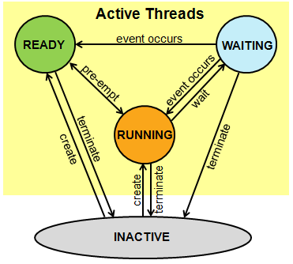

# 單晶片lab09結報
###### tags: `stm32`
###### 實驗日期 : 2021/12/09
## 上課教材
- [RTOS(上)](https://hackmd.io/@us4sw9duT5aIGbNJpCM_-Q/H16Iy48IY)

## lab1
### SPEC
利用RTOS中3條以上thread完成跑馬燈，按下開發板上的按鈕切換至下一個狀態。
1. 每隔１秒亮一顆LED，共８顆輪流亮。
2. 每隔１秒同時亮兩顆LED。
3. 每隔１秒亮一顆LED且每隔0.5秒亮一顆LED(同時)。
4. LED燈全部閃爍。

### 實現方法
```cpp
volatile int counter = 0;
volatile int counter_thread3 = 0;
```
使用兩個全局`volatile`變數，紀錄LED亮到哪一顆燈，因為是全局變數，在不同執行緒之間都可以共享。
```cpp
switch (state % 4) {
    case 0:
        thread1.signal_set(0x1); break;
    case 1:
        thread2.signal_set(0x1); break;
    case 2:
        thread1.signal_set(0x1);
        thread3.signal_set(0x1); break;
    case 3:
        thread4.signal_set(0x1); break;
}
```
`state`為紀錄狀態的變數，當按鈕被按下時，`state++`，以`state % 4`判斷就會在0到3之間之間循環。使用4個執行緒，狀態1使用執行緒1、狀態2使用執行緒2、狀態3使用執行緒1與執行緒3、狀態4使用執行緒4。

> 實際程式測試時，發現切換至不同執行緒，一開始會執行切換後的執行緒，之後再回去執行前一個執行緒，造成LED閃爍未符合預期。推測原因是未執行完但已signal觸發的執行緒會排在queue裡面，等到執行完切換後的執行緒後，會再回去執行尚未執行的task，不過這方面原因有待商榷。

## lab2
### SPEC
利用RTOS中的signals。在serial monitor輸入指令控制開發板的LED。輸入`'1'`亮綠燈、輸入`'2'`亮藍燈、輸入`'3'`亮紅燈。

### 實現方法
同[lab1 實現方法](#實現方法)。

## lab3
### SPEC
利用RTOS中的signals。將超音波模組測量到的距離(cm)顯示2位於七段顯示器，並控制開發板的LED為

|距離(cm)|LED|
|:-:|:-:|
|$d < 10$|紅燈|
|$d \in [10,15]$|藍燈|
|$d \in [15,20]$|綠燈|
|$$d > 20$$|全亮|

### 實現方法
使用別人寫好的[超音波函式庫](https://os.mbed.com/components/HC-SR04/)，接口使用如下
```cpp
// call dist when the distance changes
ultrasonic mu(p6, p7, .1, 1, &dist); 
// start measuring the distance
mu.startUpdates();
// call checkDistance() as much as possible, as this is 
// where the class checks if dist needs to be called.
mu.checkDistance();
```
參照[lab1 實現方法](#實現方法)使用signal觸發讓LED亮功能的個別執行緒，再使用[lab8 lab6實現方法](https://hackmd.io/@arduino/report-8#實現方法7)觀念顯示2位數在七段顯示器上。


## 課後習題
### Question 1
請詳述thread在Mbed平台中是如何運作的。

### Answer 1
參照[官方RTOS doc](https://os.mbed.com/handbook/RTOS)範例說明
```cpp
Thread thread;
```
建立`thread`這個類的對象，也就是創建一個執行緒。
```cpp
void led2_thread() {
    while (true) {
        led2 = !led2;
        Thread::wait(1000);
    }
}
thread.start(led2_thread);
```
開啟執行緒，並賦予其函數，`led2_thread`的函式可以視為是另一個`int main(){}`的函式入口，也就是說除了原本`main function`的執行緒外，又新增了1個執行緒，共有2個執行緒同時執行。

---

signal是用來告知process有一個event要發生，像是`std::this_thread::sleep_for(2000ms);`就是讓執行緒休息，2秒後收到一個signal再wake up起來，不同執行緒之間互相溝通也是需要signal。

### Question 2
請解釋執行多執行緒之死結(Deadlock)的問題，以及如何避免。

### Answer 2
<br>
當P1、P2兩個process都需要資源才能繼續執行。P1擁有資源R2、還需要額外資源R1才能執行；P2擁有資源R1、還需要額外資源R2才能執行，兩邊都在互相等待而沒有任何一個可執行，稱為死結(DeadLock)。

因此這邊可以總結deadlock必須要滿足以下四個條件
|條件|說明|
|:-:|:-:|
|Mutual exclusion|一個資源一次只能被一個process所使用。|
|Hold and Wait|process取得一個資源之後等待其他的資源。|
|No preemption|資源只能由process自己釋放，不能由其他方式釋放。|
|Circular wait|每個process都握有另一個process請求的資源，導致每一個process都在等待另一個process釋放資源。|

解決方法有2個 - deadlock prevention與deadlock avoidance。
- **Deadlock prevention**<br>
提供一組方法去確認至少一個必要的死結情況不會發生，這些方法靠著限制資源的需求來達成預防死結。
- **Deadlock avoidance**<br>
要求作業系統給出額外的資訊，關於一個process在他的lifetime裡會要求的resource。有了這些額外的資訊，作業系統可以決定是否讓程序的要求繼續等候。為了決定現在的要求是否能滿足，作業系統必須考慮現在資源的存量、資源的分配量、和未來資源的要求與釋放。
- ref 1 : [周志遠作業系統清大OCW影片](https://www.youtube.com/watch?v=n6YiasR-3uc&list=PLS0SUwlYe8czigQPzgJTH2rJtwm0LXvDX&index=63)
- ref 2 : [周志遠作業系統上課講義](https://drive.google.com/drive/folders/1C1s3j0nO8jo57BqBmgS55AoL_LoJr-cr)
- ref 3 : [第二十八天 死結(Deadlock)](https://ithelp.ithome.com.tw/articles/10206625)
### Question 3
請解釋program、process、thread彼此之間的關係，並舉例說明。

### Answer 3
1. program是一個**靜態**的物件，以二進位的方式存放在disk
2. process是一個**動態**的物件，是指一個**正在memory執行的program**，即是大家熟知的C/C++的memory layout空間。<br>
<br>
由上圖可知道data與text區域是不變的，而stack與heap區是會隨程式動態變化。
3. thread又稱lightweight process，是OS能夠進行programmed instructions的最小單位，同一個process下可以有多個thread執行，他們彼此之間共享code section, data section, OS resource(open files, signals)。<br>
<br>
不過以Linux來說，thread(light-weighted process)跟process從kernel角度看幾乎是一樣的。

- ref 1 : [周志遠作業系統清大OCW影片](https://www.youtube.com/watch?v=f-mBLtGY6Ig&list=PLS0SUwlYe8czigQPzgJTH2rJtwm0LXvDX&index=20)
- ref 2 : [周志遠作業系統上課講義](https://drive.google.com/drive/folders/1C1s3j0nO8jo57BqBmgS55AoL_LoJr-cr)
- ref 3 : [Memory Layout of C Programs](https://www.geeksforgeeks.org/memory-layout-of-c-program/)
- ref 4 : [Difference between Process and Thread](https://www.geeksforgeeks.org/difference-between-process-and-thread/#)

## 心得
### 劉永勝
這次實作基礎的mbed OS程式，我們常需要搭載許多模組在同一個開發版上使用，若只使用一個程序性的main function，可能造成多數元件處於靜止的狀態，無法有效分配開發版的作業效能。利用這次OS的觀念，可以讓其他模組以thread的方式，保持隨時可觸發狀態，即時的操作模組，開發版資源也能被有效運用。

### 李宇洋
這次實驗主要是了解Thread跟Signal的概念，並且在實作Lab時實現多執行緒。一開始由於對於Thread如何使用不理解，所以卡住了將近2小時在研究他的執行流程，`Thread.start()`後會一直不斷處於Idle狀態並且等待Signal後執行相應Method。原本認為Signal Flag的設定是類似密碼的概念，但是其實只是讓Stm32判定是要讓哪個Thread執行動作，在Method裡面還是要自行處理後判定何時讓Thread回到Idle狀態。

### 陳旭祺
這次實驗只有3個實作，內容較簡單，學習創建新的thread與用signal(用來告知process有一個event發生)去觸發指定的thread運作。multi-thread programming是個寫程式很進階的topic，有很多需要注意的問題，像是2個執行緒搶同一份資源、如何解決deadlock，這部分可能未來需要修作業系統等課程比較能深刻了解，就本此實驗而言，算是對multi-thread一個很粗淺的了解，因為我們也沒有相關的知識背景。