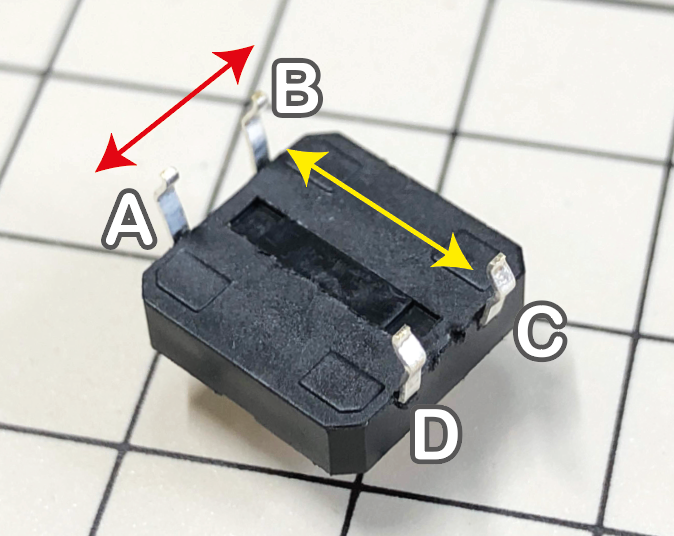
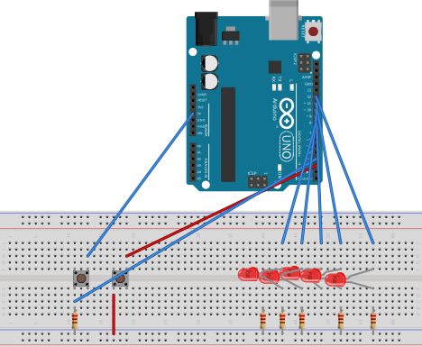
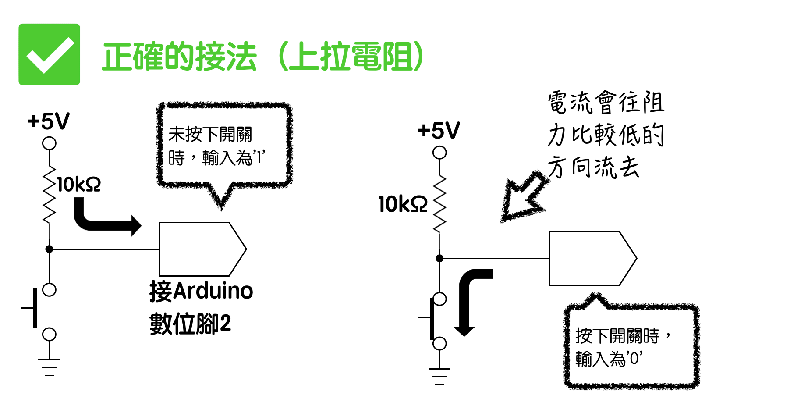
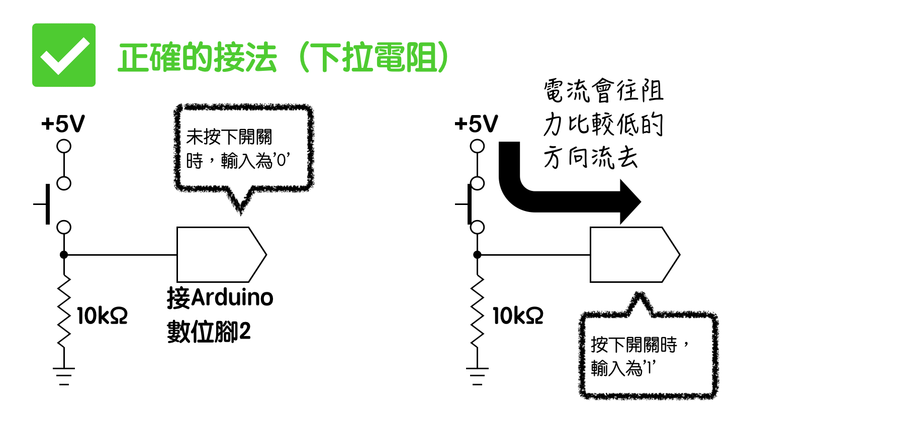
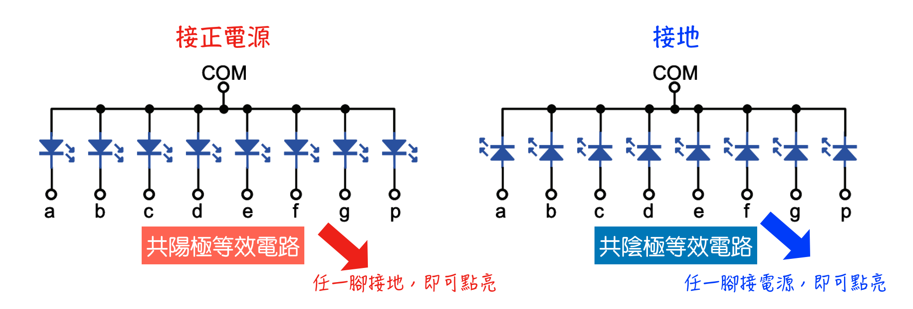
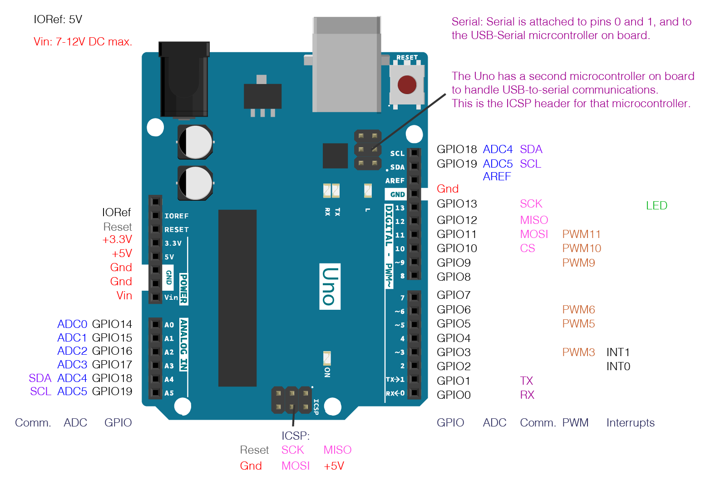
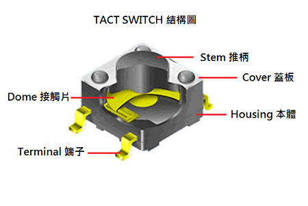
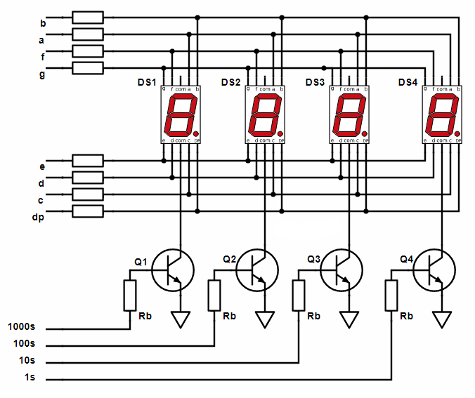
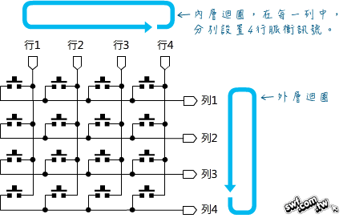

# 單晶片lab1結報
###### tags: `arduino`
###### 實驗日期 : 2021/09/23
## 上課教材
- [環境與跑馬燈、按鍵、多工七段顯示器、鍵盤](https://hackmd.io/@Alanzzzz/SJDW5IumK#LAB-2-1-Button-amp-LED)

## lab1-1
### SPEC
5個GPIO的呈現燈亮從左到右的跑馬燈狀態。

### 實現方法
用一個for loop由左到右讓LED亮一下再關掉。

## lab1-2
### SPEC
5個GPIO呈現queue的跑馬燈狀態。

### 實現方法
用**二維矩陣把每個LED的個別stage都列出來**，1代表亮、0代表不亮，增加程式的可讀性。

## lab2-1
### SPEC
用Button控制LED燈亮向左或向右。

### 實現方法
- 按鈕接法為A、B或C、D接線，而A、D與B、C是接通的。


- 接口2號使用上拉電阻(系統內建`INPUT_PULLUP`)；接口3號使用下拉電阻(需由使用者自行實踐)。


|項目|說明|按下條件|
|:-:|:-:|:-:|
|上拉電阻||`LOW`|
|下拉電阻||`HIGH`|

- 使用3目運算符分2種情況
    1. 一般情形，**相對**位置加1。
    2. 當到達最右(最左)LED時，**絕對**指定下一個位置。
    
## lab2-2
### SPEC
一LED燈控制按鈕需考慮de-bouncing問題；另外一顆LED燈則保持以每秒亮按的頻率持續閃爍。

### 實現方法
在不使用delay之下，用一整數累加到指定臨界值即可。

## lab3-1
### SPEC
控制多工七段顯示器顯示`2021`。

### 觀念
多工七段顯示器(Multiplexed Seven-Segment display)使用多個七段顯示器。七段顯示器功能為解碼訊號為7個LED組合，再利用控制訊號決定哪一個七段顯示器要亮與否。

- dp代表小點，功能為判定裝置是否插電。
- 共陰極代表所有LED接地端都相連，故LED的另一端接高電位就會發光；共陽極則相反。


### 實現方法
首先用pin腳`10-13`控制訊號依序快速顯示個、十、百、千位數，以肉眼無法難以察覺的速度快速亮暗切換，以達成同時顯示4位數字的目的。

再來是依序選擇數字0-9，將十進位數(`int`)解碼七段顯示器的7個LED訊號(顯示小數點的dp除外)並寫入訊號顯示。

## lab3-2
### SPEC
控制多工七段顯示器，每隔一秒計數加一。

### 實現方法
1. 新增一變數`number`為秒數器，初始化為0
2. 將四位數擷取並存於陣列
3. 選擇要讓哪個七段顯示器亮(如前一實驗)
4. 選擇要亮數字0-9(如前一實驗)
5. **判斷number是否加1**

使用millis函式，如官方doc解釋
> ```c
> time = millis()
> ```
> Returns : Number of milliseconds passed since the program started. <br>
> Data type: unsigned long.

當`millis`與`timer`相差1000(ms)，則`number++`，並更新`timer`值與`millis`相同。

## lab4-1
### SPEC
以模組`Keypad`鍵入資料，將資料傳輸至serial monitor。

### 實現方法
- row是上拉電阻(未按1、有按0)，column是輸出腳位
外層`for`迴圈依序將colun１-4設置成低電位來檢測，而內層`if`迴圈是判定當按紐被按下，row為0時，傳對印二維矩陣的`char`到監控埠。

## lab4-2
### SPEC
以模組`Keypad`鍵入資料，將值暫存在buffer中，按下`#`會將之前輸入的字元依序傳輸至serial monitor。

### 實現方法
引用內建函式庫`keypad.h`，說明參照[官方doc](https://playground.arduino.cc/Code/Keypad/) :
```cpp
Keypad myKeypad(makeKeymap(keymap), rowPins, colPins, KEY_ROWS, KEY_COLS);
```
使用有參構造函數，創建一個屬於`Keypad`類的對象。
```cpp
char key = myKeypad.getKey();
```
調用成員函數`char getKey()`，函數使用說明如下:
>Return : the key that is pressed, if any.<br> This function is non-blocking.

用一個字符陣列去存得到的字符，並用一個`int count`去累加紀錄加到哪裡。
```cpp
key == '#'
```
當讀入`#`，把前面的字符印出，並把`int count`歸零重數。

## lab4-3
### SPEC
掃描式鍵盤與七段顯示器之結合，實作碼錶，功能如下 :

|按鍵|觸發功能|
|:-:|:-:|
|`A`|進入計時模式|
|`B`|進入倒數計時模式(先輸入欲倒數秒數)|
|`C`|開始|
|`D`|暫停|
|`*`|重新開始|
|`#`|離開並進入選擇模式|

### 實現方法
層級如下:
- `mode == A`
    - print "AAA"
    - `while(1)` -> 卡在無窮迴圈
        - `counter++` -> 計秒器++
        - `if( control_A == 'D')` -> 停止計時
        - `if (control_A == '*')` -> 歸0重數
        - `if (control_A == '#')` -> 跳出迴圈
- `mode == B`
    - print "BBB"
    - `while (count < 3)` ->輸入3位數後跳出
        - `isDigit(digit)` -> 判斷輸入是否valid
    - `reset`變數紀錄原本輸入的值
    - `while(1)` -> 卡在無窮迴圈
        - 顯示輸入數字
        - `if (start == 'C')` ->直到按下C才開始倒數
            - `while(1)` -> 卡在無窮迴圈
                - `counter--` -> 計秒器--
                - `if( control_A == 'D')` -> 停止計時
                - `if (control_A == '*')` -> 歸`reset`重數
                - `if (control_A == '#')` -> 跳出2層迴圈

## 課後習題
### Question 1
Arduino微處理器不僅包含MCU，還內建記憶體、類比/數位訊號轉換器以及周邊控制介面，相當於將完整的電腦功能塞入一個矽晶片中，所採用的微處理器是ATmega328P。根據下圖，標示在Arduino UNO板上的**digital與analog I/O的位置、數量以及相關用途**(如：通訊、中斷......)。

### Answer 1 


- **Input mode**<br>
MCU透過GPIO腳從外面收信號，可以進行**外接感測器(溫度、紅外線感測器)狀態、高低電位**等資訊的獲取。
- **Output mode**<br>
MCU透過GPIO腳將信號送出，可用於**控制LED、蜂鳴器及伺服馬達**。
- **UART/I2C/SPI**<br>
**I2C**(LCD 16x2)、**SPI**(10~13)、**UART**(Bluetooth)、**IRQ**(中斷要求)(2、3)信號等多種用途。

---

1. **Digital**<br>
右半邊D0~D13除了GPIO之外，還有以下其他功能 :
- **D0**<br>
用來接收(RX) TTL serial data。
- **D1**<br>
用來傳輸(TX) TTL serial data。
> TTL serial data 亦即 電腦的USB 到 arduino上TTL 之序列埠傳輸，應避免使用這兩個腳位。
- **D2、D3**<br>
  此兩個腳位可用來外部中斷，其中斷觸發條件有四種，依序為 :
    - **LOW**<br>
      當 pin 為 LOW 時觸發中斷。
    - **CHANGE**<br>
      當pin狀態改變時觸發中斷，`HIGH`到`LOW`之間切換。
    - **FALLING**<br>
      當pin狀態從`HIGH`到`LOW`時觸發中斷。
    - **RISING**<br>
      當pin狀態從`LOW`到`HIGH`時觸發中斷。
    > 外部中斷如同CPU和OS的觀念，基於整體程式需求，OS會發出指令使CPU從當前程序中斷，處理別的項目，處理完後，再回到中斷程序繼續執行。
- **D3、D5、D6、D9、D10、D11**<br>
這六的腳位旁邊有標示"~"符號，可做為類比輸出，以8-bit PWM之方法作為類比輸出。
> PWM為Pulse Width Modulation，亦即藉由調高輸出數位訊號之頻率轉為類比。
- **D7**<br>
arduino可使用藍芽無線技術來操作，而此腳位可憐加藍芽模組作為重製使用。
- **D13**<br>
Arduino上備有一顆LED，當此腳位為`HIGH`時LED亮，`LOW`時LED暗。

---

2. **SPI**<br>
一種主從式架構的同步資料協定，用於短距離通訊。下方四個腳位可供使用 :
- **D10(SS, Slave Selected)**<br>
`LOW`時enable訊號，代表裝置可以與Master通訊。
- **D11(MOSI)**<br>
master數據輸出、slave數據輸入(主出從入)。
- **D12(MISO)**<br>
master數據輸入、slave數據輸出(主入從出)。
- **D13(SCK, Serial Clock)**<br>
時脈信號(CLK)，由master產生並控制。

---

3. **Analog** (為於左下角)<br>
左半邊A0-A5可作為類比輸入使用、但不能類比輸出，類比輸出需透過先前提到的PWM進行。此外此6個腳位也可做為數位輸入、輸出使用，別名為D14-D19。

---

4. **Power** (位於左上角)<br>
- **VIN**<br>
可用於外接電源供應器輸入電壓是arduino。
- **5V**<br>
可從arduino提出5V至外部電路使用，其電壓從VIN提取。
- **3.3V**<br>
可從arduino提出3.3V至外部電路使用，其電壓從FTDI chip提取。
- **GND**<br>
接地。

### Question 2
1. 描述機械式開關的彈跳現象。
2. 在ATmeg328p微控器的數位接腳有內建上拉電阻，預設沒有啟用，該上拉電阻值介於20kΩ至50kΩ之間；而一般外接10kΩ的上拉電阻，甚至在要求高反應速率的電子訊號切換時會使用4.7kΩ或是1kΩ的上拉電阻。試問：**上拉電阻值的高低對於處理雜訊干擾的能力之間的關係?**

### Answer 2
1. 機械式開關為金屬彈性體製成，**彈性體在受力瞬間會有諧振行為，使得按壓機械式開關時，諧振行為發生**，造成按鈕內部的電子接點形成時而開起、時而閉合的狀態，訊號短時間的不穩定，稱為彈跳現象。


2. 根據歐姆定律，上拉電阻能將不確定之訊號藉由電流的方式輸入元件中。**當上拉電阻過大時，對輸入訊號形成高阻抗，電流無法通過，稱為浮接**，訊號變為隨機不穩定之數值，雜訊亦增加。因此，在使用ATmeg328p時，不使用預設的高阻抗，而是另外連結1~10kΩ之上拉電阻，以減少訊干擾。

### Question 3
描述多工七段顯示器及鍵盤掃描的工作原理。

### Answer 3
1. **多工七段顯示器工作原理**<br>

多工七段顯示器可以解決驅動4個顯示器所需要的pin腳過多的問題。<br>
將每個顯示器所需要之segements (a~g)的部分利用Arduino輸入後，多工七段顯示器會先將第一個顯示器需要的線路快速開啟(頻閃)後再換至下一個顯示器所需的線路，以此不斷重複。由於開啟之過程過於迅速，人眼會因為視覺暫留只看見所有顯示器都開啟並呈現恆亮的狀態。
- ref : [7-segment display basics](http://lednique.com/display-technology/7-segment-display-basics/)

2. **鍵盤掃描工作原理**<br>

反覆地將**每一行快速寫入低電位(Low)的脈衝訊號，作為掃描用途**，當按下按鈕時，Arduino會偵測到是哪一行按下按鈕並做出反應。與此同時，**每一列會不斷地反覆掃描(讀入)信號**，一旦偵測到低電位信號則可以確定是哪一列被按下。<br>
由於寫入與掃描的速度都很快，因此Arduino可以正確的接收到哪一行或哪一列被按下，所以將兩個迴圈一起使用時就可以確定是哪一行哪一列的按鈕被使用者按下。
- ref : [Arduino 4×4薄膜鍵盤模組實驗](https://swf.com.tw/?p=917)

## 心得
### 劉永勝
這次實驗包含了9個子實驗，主要是用來熟悉元件使用和程序編寫，程序部分與C大致相同，使用起來沒什麼問題，但在編程時，需要思考IO、訊號高底、延遲時間這類硬體方面的限制才能在arduino上完成實作。

元件方面，四位數七段顯示器、鍵盤掃描都是新的原件，需要先知道個別運作原理，才能用C語言進行描述，控制IO端口訊號。目前實驗還算有趣，退意還沒產生，期待下次實作。

### 李宇洋
此次實驗主要是了解Arduino的各項功能以及熟悉Arduino IDE的使用方式，因為是遠距的關係，所以有些地方想不通或是想問助教一些問題都不太方便，因此第一次實驗出來的結果沒有很好，在課堂中完成的實驗數量不如預期，主要應該是因為不熟悉操作以及不了解元件運作的關係，需要在學習理解多工七段顯示器、按鈕、Keypad上多花點心思才有辦法再應付下一次實作。

### 陳旭祺
由於本人程式能力欠佳，暑假時我重新學了一遍`C/C++` - 了解指標、OOP、常見資料結構等程式的基礎。三上修這門課除了延續暑假的程式學習並結合電機系課程(電工實驗、電子學等)學到的硬體，希望能了解軟硬體的整合操作。

由於COVID-19疫情改成遠距教學，禮拜四上課時，我沒有實際參與，因此事後我實際操作各個實驗的流程，程式與硬體沒有很難，但需要花時間去理解相關原理，這部分可以參閱 :
- 程式API接口部分 -> [Arduino官方doc文件](https://www.arduino.cc/reference/en/)
- 硬體部分 -> datasheet的PDF文件

養成會看官方文件的好習慣，如此才能獲得第一手的資料，也能獲得可信度較高的資訊。另外我也打了個人筆記[Arduino筆記](https://hackmd.io/@HsuChiChen/arduino-note)，重點為比較Arduino與C/C++的不同之處、Arduino函式庫引用與分文件編寫。希望我能多學習、勤能補拙，方能跟上大家的進度。