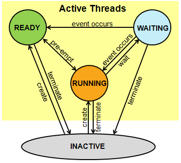

# 單晶片lab10結報
###### tags: `arduino`
###### 實驗日期 : 2021/12/16
## 上課教材
- [RTOS(下)](https://hackmd.io/@mzTjnf74ST6xKOB4FrGblQ/BJdEY4DqF)

## lab1
### SPEC
利用RTOS中的`Thread`, `Semaphore`, `Mutex`完成跑馬燈，按下開發板上的按鈕切換至下一個狀態。
1. 每隔１秒亮1顆LED，共3顆輪流亮。
2. 每隔１秒同時亮2顆LED。(`Semaphore`狀態)
3. 每隔１秒LED燈全部閃爍。(`Mutex`狀態)

### 實現方法
承[單晶片lab9結報 lab1實踐內容](https://hackmd.io/@arduino/report-9#實現方法)3個state的切換，這次改成在副程式觸發，因為程式會卡在副程式的`while loop`不斷執行。第2個狀態使用允許同一時間同一資源可以被2個執行緒訪問的Semaphore，並新增5個執行緒，加上原本的`int main{}`，共6個執行緒，分別執行亮LED1+亮LED2、亮LED2+亮LED3、亮LED3+亮LED1，實現每隔１秒同時亮2顆LED。

第3個狀態使用(允許同一時間同一資源可以被1個執行緒訪問)mutex，間隔1秒，執行緒1反轉LED1燈亮暗狀態、執行緒2反轉LED2燈亮暗狀態、執行緒3反轉LED3燈亮暗狀態，由於訪問時間太快，導致看起來是同時3個LED會切換狀態，實現每隔１秒LED燈全部閃爍。
> 個人覺得是很沒有意義的實作，只是硬要用到multi-thread觀念，去做出不需要用到multi-thread的功能，多此一舉。

## lab2
### SPEC
利用RTOS中的`Mail`與使用`Thread::wait()`計時實現碼錶。
|Serial monitor輸入值|功能|
|:-:|:-|
|`'s'`|開始計時(精度: 10ms)|
|`'p'`|顯示計時的秒數並停止計時|
|`'r'`|歸零並停止計時|

### 實現方法
```cpp
typedef struct {
    bool clock_start;
    float counter; //counter value
} mail_t;
Mail<mail_t, 16> mail_box;
```
新增一個自定義的結構體，命名為為`mail_t`，並將其結構給`Mail`這個template class，作為初始化資料型態，當Serial monitor輸入指定時，就直接改`Mail`類的對象，public變數`mail->clock_start = false`即可。

## 課後習題
### Question 1
詳述Thread在Mbed平台中是如何運作。

### Answer 1
同[單晶片lab9結報 Question 1](https://hackmd.io/@arduino/report-9#Question-1)。

### Question 2
解釋Mbed平台API中，`wait()`與`Thread::wait()`兩者差別。

### Answer 2
視版本而定，而有所差異。根據[mbed_wait_api.h原始碼](https://os.mbed.com/docs/mbed-os/v6.15/mbed-os-api-doxy/mbed__wait__api_8h_source.html)與[Thread API文檔](https://os.mbed.com/docs/mbed-os/v5.15/apis/thread.html)描述 :
> `void wait_us(int us);` This function spins the CPU to produce a small delay. As it is calculated based on the expected execution time of a software loop, it may well run slower than requested based on activity from other threads and interrupts.

> `Thread::static osStatus wait(uint32_t millisec)` Wait for a specified time period in milliseconds Being tick-based, the delay will be up to the specified time - eg for a value of 1 the system waits until the next millisecond tick occurs, leading to a delay of 0-1 milliseconds.

<br>
簡單來說，`wait()`使用程式的`loop`迴圈，讓CPU不斷運行，這種情況稱為`spinlock`；而`Thread::wait()`會將目前執行緒的狀態拉至`waiting state`，因此其他執行緒一樣不受影響，可以繼續執行，如果沒有其他執行緒在`ready state`，會讓整個MCU進入`sleep`以節省電源。


## 心得
### 劉永勝
不同於上次實驗，這次使用multithread來共享同一區塊的程式碼(資源)，藉由開關的方式，控制每個thread執行的時間點。而我們這次的Lab1雖然可以依序執行功能，但可能是因為製造的thread太多，造成執行序無法順利進行，而無法反覆執行三項程序。期末專題的限期逐漸逼近，近期實作無作業系統的觀念也無心學習新知識，願之後實作能好懂些。

### 李宇洋
包含上次與這次的OS實作因為對於多執行緒實際的執行情況理解過少，因此在實作過程卡住了非常久，甚至到實驗完對於講義中提到multithread運用的Queue、Semaphore等方法如何互相交換主控權仍是一知半解。但是還是能大致推斷出因為我們在Lab 1中使用了`Terminate`的寫法，導致程序中的`wait`和`release`尚未使用以及釋放記憶體空間便被終止，這導致了我們在實作中無法從mode 3回到mode 1。

### 陳旭祺
參考[周志遠作業系統](https://www.youtube.com/watch?v=vNTAk2vpoOk&list=PL9jciz8qz_zyO55qECi2PD3k6lgxluYEV&index=41)，多線程要共享資源時需要同步(Process Synchronization)，以免線程之間取到的資源不同步，也就是race condition的情況，因此要找出他的critical section，使用Mutex(Mutual Exclusion)去鎖住critical section，確保同一時間內資料只會有單一存取。

而Semaphore算是一個比起Mutex更generalized的機制，本質上是一個計數，紀錄這個critical section可以同時被幾個線程共同執行，因此當數量為1時，代表這個critical section只能被一個線程執行，稱為binary Semaphore，等於前面講的Mutex。

---

老實說，我覺得這次實作內容很沒有意義，lab1不需要用多線程來寫，也不存在共享資源的衝突，硬要用多線程來寫；而lab2也不知道意義為何，直接訪問並改變這個類的變數即可。