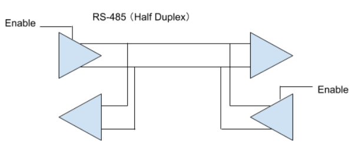
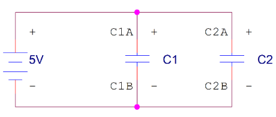
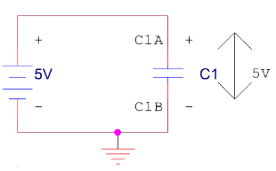
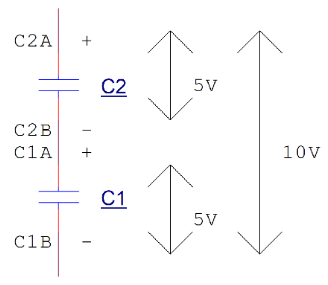

# 單晶片lab2結報
###### tags: `arduino`
###### 實驗日期 : 2021/09/30
## 上課教材
- [密碼鎖、計步器](https://hackmd.io/@G8HrHAUqQyCt9mHFYW05UA/rJSzxDQ-K#Arduino%E8%AC%9B%E7%BE%A9%EF%BC%9A%E8%A8%88%E6%AD%A5%E5%99%A8)

## lab1
### SPEC
**密碼鎖** - 自訂一個密碼(ex:`1234`)，使用keypad來輸入值，輸入完成後按`A`送出。若輸入值與密碼相同則印出`Unlock!`，錯誤則印出`Wrong passwords!`。

### 實現方法
```cpp
if (enter != NO_KEY) {
    if (enter == 'A') {
        break;
    } else {
        value[count++] = enter;
        Serial.print(enter);
    }
}
```
將輸入的字串存於字符陣列，但`'A'`不儲存。

```cpp
if (strcmp(value, password) == 0) {
        Serial.println("Unlock!");
    }
```
使用[C-string字串處理的函式](https://hackmd.io/@HsuChiChen/c-style-string)，與正確密碼的字符陣列去做比較。

## lab2-1
### SPEC
承上題，增加2項功能 :
1. **修改密碼**。
2. **添加驗證碼**(透過七段顯示器顯示經過`random()`得出的3位驗證碼，並在輸入錯誤時再隨機變換一組驗證碼直到輸入正確)。

### 實現方法
延續lab1程式
```cpp
if (enter != NO_KEY) {
        if (enter == 'B') {/*revise password*/} 
        else if (enter == 'A') {/*enter password*/}
```
分2個個模式 - 按`B`為修改密碼，按`A`為輸入密碼。
```cpp
void input(char terminal_char, char value[]);
void input_3(char terminal_char, char arr[]);
```
2個subfunction中**相同點為傳入之參數** :
- 第1個參數判定keypad輸入終止字串的字符。
- 第2個參數傳入儲存之字串陣列。

**不同點1為使用時機與功能** :
- 前者是輸入並儲存4-digit的數值。
- 後者是輸入並儲存3-digit的數值(驗證碼)，並且要在等待使用者輸入的同時，讓**七段顯示亮燈**，關於亮燈我是寫進一個`class`，要用到的時候就可直接呼叫成員函數`show_seg.show(verification);`，詳見[lab4實現方法第2點](#實現方法4)。

**不同點2為是否有把最後終止字符儲存至字串陣列** :
- 前者是**字串比較**，承如[lab1實現方法](#實現方法1)，只會以`char`型態儲存輸入之數值，最後不會儲存終止字符。
```cpp
if (strcmp(input_value, password) == 0) {
    Serial.println("Unlock!");
}
```
- 後者為**整數比較**，最後會儲存字符，才能進行`atoi()`的正確轉換。<br>使用整數的目的為
    1. 配合`long random(min, max)`回傳值的**資料型態**。
    2. 方便調用我寫的`7-seg display`**這個`class`成員函數的接口**`void SHOW_SEG::show(int num);`。
```cpp
if (verification_code == atoi(input_value)) {
    Serial.println("Correct!");
}
```


## lab2-2
### SPEC
使用keypad輸入一個三位數字，實現**終極密碼** $\text{answer} \in [0, 999]$。

### 實現方法
```cpp
while (true) {  //4-digit number
    enter = keypad.getKey();
    if (enter != NO_KEY) {  //input
        guess_ch[count++] = enter;
        if (isDigit(enter)) {
            Serial.print(enter);
        } else if (enter == 'A') {
            break;
        }
    }
}
```
- 第一層`if`判斷檢查是否輸入數值，內建`NO_KEY`為按鍵沒有被按下的值。
- 第二層`if`判斷輸入的合法性(validity)，限定為輸入的資料型態為數字。

```cpp
guess = atoi(guess_ch);
```
由於在前一程式最後按下`A`輸出時，會把字符`'A'`存進輸入數值的最後，在這邊起到**辨識數值長度**的功能，因為`atoi()`遇到**非數字**或**字符串結束('/0')** 時會結束轉換，並將結果返回。

## lab3
### SPEC
利用`MPU-6050`做出**計步器**功能。(只使用三軸加速度($a_x, a_y, a_z$)之值來進行運算，代表只有判斷旋轉角度)

## 觀念
`MPU6050`是一種非常流行的空間運動傳感器芯片，可以獲取器件當前的**3個加速度分量**和**3個旋轉角速度**。由於其體積小巧，功能強大，精度較高，不僅被廣泛應用於工業，同時也是航模愛好者的神器，被安裝在各類飛行器上馳騁藍天。

自帶了一個**數據處理子模塊DMP**，已經內置了濾波算法。數據接口用的是$\rm I^2C$(讀音 : I-squared-C)總線協議([原理](https://www.cntofu.com/book/46/arduino/i2c_protocol_yuan_li_ji_ying_yong.md))。

數據寫入和讀出均通過其IC內部的**寄存器**實現，這些寄存器的地址都是1個byte，也就是8位的尋址空間。

- 詳細資訊請參閱[MPU-6050 datasheet](https://invensense.tdk.com/wp-content/uploads/2015/02/MPU-6000-Datasheet1.pdf)。

### 實現方法
1. **正規化**<br>
```cpp
int sensitivity = 32767 / 250;
```
當$G_X$取正最大值$32768$時，當前角速度為順時針$250\;\omega/s$，故可得靈敏度，即為**角速度1秒內1弧度**所代表的數值為

$$ \frac{32767}{250\;\omega/s} \tag{1.1} $$

2. 將加速度數據代入回推**變化角度**<br>

$$\tan^{-1}\Bigg[\; \frac{A_x} { \sqrt{(A_y)^2 + (A_z)^2} }\;\Bigg] \times \frac{180}{\pi} \tag{2.1}$$

$$\tan^{-1}\Bigg[\;\frac{A_y} { \sqrt{(A_x)^2 + (A_z)^2} }\;\Bigg] \times \frac{180}{\pi} \tag{2.2}$$

$$\tan^{-1}\Bigg[\;\frac{ \sqrt{(A_x)^2 + (A_y)^2} }{A_z} \;\Bigg] \times \frac{180}{\pi} \tag{2.3}$$

3. 在`50`筆資料內，**每測量一次更新最小與最大值**，並相減。<br>
4. 最後檢查**是否超出臨界值**，條件為 :
$$(θ_x)^2 + (θ_y)^2 + (θ_z)^2 < (\text{threshold})^2 \tag{4.1}$$

## lab4
### SPEC
承上題，**加上七段顯示器顯示**。

### 實現方法
延續lab3程式
1. 觀察題目要求增加步數之數列為:
$$0 + 1 + 8 + 27 + ...... +\; n^3 = \sum_{k=0}^{n} k^{3} \tag{1.1}$$

2. 為簡化程式碼，使用`OOP`觀念，將`4-digit 7-segment display`驅動封裝成一個`class`，因此在主函數只需要增加2行 :
```cpp
SHOW_SEG::SHOW_SEG(int first_pin, int last_pin)
```
創建類對象，並調用**有參構造函數**，第一至第二參數為七段顯示器連續接口，即 $\text{pin} \in [2, 13]$。

```cpp
void SHOW_SEG::show(int num);
```
調用**這個類的成員函數`show()`**，外部使用者只需要輸入一個整數，即可使七段顯示器亮燈，不需知道內部是如何實現，實現函數封裝。


## 課後習題
### Question 1
請說明非同步傳輸中的`RS-232`, `RS-422`以及`RS-485`，並討論這三者的差別為何?

### Answer 1 
Arduino藉由`UART`作為資料傳輸介面，其線路僅有傳輸(TX)、接收(RX)兩個，以邏輯電路的形式傳輸資料，高電位時為1、零電位時為0。在Arduino要與PC溝通時，**由於PC沒有`UART`的傳輸介面**，則需要以下傳輸介面作為轉換，其差異如下:

|傳輸介面|說明|
|:-:|:-:|
|**RS-232**|點對點通訊，傳送和接收端共用一個接地電位，並用**一根訊號線上的電壓**來判斷傳送的狀態爲0或1，容易引起干擾。|
|**RS-422**|以**差動**的方式傳輸資料，兩根接收、兩根傳輸，因此可以同時發送與接收信號，即：**全雙工通信(full-duplex)**。藉由差動的方式可以減少雜訊干擾，可用於遠距離傳輸。|
|**RS-485**|與`RS-422`差動傳輸原理相同，差別在於**只有兩根線同時作為傳輸、接收使用**，因此無法同時發送與接收信號，故只能使用**半雙工通信(half-duplex)**。因為僅需兩條線就可傳輸，適用於佈線成本高但是資料傳輸量需求不高的應用中。|

|


- 各傳輸介面之驅動電壓

|傳輸介面|邏輯0|邏輯1|
|:-:|-:|-:|
|**UART**|`0` V|`3.3` or `5` V|
|**RS-232**|`3`~`15` V|`-3`~`-15` V|
|**RS-422**|`-2`~`-6` V|`2`~`6` V|
|**RS-485**|`-1.5`~`-6` V|`1.5`~`6` V|

- `UART`和`RS-232C`之間要如何轉換?<br>
透過一顆`RS-232C`的傳送/接收器叫做`MAX232`，內部設計2個非常巧妙的電路 - **charge pump升壓**和**反向電路**，儘管只有這顆IC只有`5V`供電，還能輸入`RS-232`的正負電壓與高於`5V`之電壓。以下2個電路在`MAX232`內部是由4個電容器和一系列的開關切換電路自動完成 :
    1. **Charge pump**
    
    |原始|後來|
    |:-:|:-:|
    |兩個電容器`C1`和`C2`，分別用`5V`電源將它們充飽|讓`C1`和`C2`脫離電源，並串聯起來|
    |||
    
    2. **反向電路**
    
    |原始|後來|
    |:-:|:-:|
    |一個電容器充電|將它的極性對調，讓原來電位比較高的那支腳與系統的`0 V`電位相連，由於電容器裡面的電位差不會改變，所以原來低電位那隻腳，現在相對於`0V`來說就是負電壓|
    |||

- ref : [【Maker電子學】認識UART界面#1—訊號格式](https://makerpro.cc/2019/12/uart-part-1/)

### Question 2
`MPU-6050`的接腳`XDA`、`XCL`、`AD0`功能為何?

### Answer 2
|接腳|介紹|
|:-:|:-|
|`VCC`|提供`MPU-6050`系統電壓，3~5V皆可。|
|`GND`|`MPU-6050`系統接地。|
|`SCL`|$\rm I^2C$通訊協定所需的**時脈週期**。|
|`SDA`|藉由$\rm I^2C$通訊協定**傳輸資料**。|
|`XDA`|以`MPU-6050`為master、額外模組為slave，**傳輸資料給額外模組**。|
|`XCL`|以`MPU-6050`為master、額外模組為slave，**提供時脈週期給額外模組**。|
|`AD0`|當有兩個`MPU-6050`連接在同一個master(arduino board)上時，須分別給兩個slave(`MPU-6050`)**不同通訊位址**。 `LOW`->`0x68`、`HIGH`->`0x69`，可自行選擇其通訊位置。|
|`INT`|中斷`MPU-6050`計算程序，**使arduino可讀取其資料**，以避免`MPU-6050`資料溢位。|

### Question 3
請問取`random`數字時不使用`randomSeed()`的差別在哪?

### Answer 3
- **`random(max), random(min, max)`**<br>
生成隨機亂數。
- **`randomSeed(unsigned long seed)`**<br>
初始化偽隨機數生成器，使其從隨機序列中的任意點開始。生成序列取決於種子碼的值，因此都是一樣的，若要不同，則需指定一個亂數種子。
- **舉例說明**<br>
以lab2-1、lab2-2為例，使用`randomseed()`時，其seed的來源為未連接的pin腳`analogRead(0)`所讀取到的值，由於該腳位為連線，因此會受其他因素(其他模擬輸入的值、手與電路板的距離等)影響。
> 此觀念與`C/C++`相同。

### Question 4
下方為不呼叫`MPU-6050 library`來讀出`MPU-6050`數值之程式，
請為其標上完整的註解。

### Answer 4
```cpp
#include<Wire.h>
```
- **函式庫引用**<br>
`MPU6050`使用$\rm I^2C$(讀音 : I-squared-C)總線協議([原理](https://www.cntofu.com/book/46/arduino/i2c_protocol_yuan_li_ji_ying_yong.md))，因此我們需要頭文件`<Wire.h>`來實現Arduino與`MPU6050`之間的傳輸。
```cpp
const int MPU_addr=0x68; 

//在程式執行開始時會執行一次，用於初始化設定
void setup(){
  Wire.begin(); 
  //初始化Wire.h並作為master or slave加入I2C bus
  //如未指定7-bit slave地址(函數重載)，則為加入者為master
  Wire.beginTransmission(MPU_addr); //開啟MPU6050的傳輸
  Wire.write(0x6B); //指定寄存器地址
  Wire.write(0); //寫入一個字節的數據
  Wire.endTransmission(true); //結束傳輸，true表示釋放總線
```
- **將數據寫入MPU-6050**<br>
在每次向器件寫入數據前要先打開`Wire`的傳輸模式，並指定器件的總線地址，`MPU6050`的總線地址是`0x68`(`AD0`引腳為高電平時地址為`0x69`)。然後**寫入一個字節的寄存器起始地址，再寫入任意長度的數據**。<br><br>
這些數據將被連續地寫入到指定的起始地址中，超過當前寄存器長度的將寫入到後面地址的寄存器中。寫入完成後關閉`Wire`的傳輸模式。示例是向`MPU6050`的`0x6B`寄存器寫入一個byte`0`。
```cpp
  Serial.begin(38400); //設定傳輸時的baud(每秒有幾個bit)
}

//重複執行在loop()函式中的程式碼，直到Arduino硬體關閉
void loop(){
  Wire.beginTransmission(MPU_addr); //開啟MPU6050的傳輸
  Wire.write(0x3B); //指定寄存器地址
  Wire.endTransmission(false); //開啟傳輸模式
  Wire.requestFrom(MPU_addr,14,true); //從MPU要求14byte資料
  AcX=Wire.read()<<8|Wire.read(); //兩個字節組成一個16位整數 
  AcY=Wire.read()<<8|Wire.read();  
  AcZ=Wire.read()<<8|Wire.read();
  //Tmp=Wire.read()<<8|Wire.read(); //題目少一行，與溫度有關之數值
  GyX=Wire.read()<<8|Wire.read();  
  GyY=Wire.read()<<8|Wire.read(); 
  GyZ=Wire.read()<<8|Wire.read(); 
```
- **從MPU-6050讀出數據**<br>
讀出和寫入一樣，要先打開`Wire`的傳輸模式，然後寫一個字節的寄存器起始地址。接下來將指定地址的數據讀到`Wire.h`的緩存中，並關閉傳輸模式，最後從緩存中讀取數據。<br><br>
示例是從`MPU6050`的`0x3B`寄存器開始讀取`14`個byte的數據。由於[`Wire.read()`回傳值](https://www.arduino.cc/en/Reference/WireRead)為**下一個接收到byte**，總共`14`個`Wire.read()`，因此master才會要跟slave要`14`個byte。依序兩兩一組，先讀到的A向左位移`8`bit，後讀到的B與A做`Bitwise OR`因此等同於2個`8`個bit整數concatenate成一個`16`個bit整數。<br><br>舉例來說
$$
\begin{array}{clcr}
\text{字串A} & 1 & 0 & 0 & 1 & 1 & 1 & 1 & 1\\
\text{字串A left shift 8 bits} & 1 & 0 & 0 & 1 & 1 & 1 & 1 & 1 & 0 & 0 & 0 & 0 & 0 & 0 & 0 & 0\\
\text{字串B} & & & & &  &  &  &  & 1 & 0 & 1 & 0 & 0 & 1 & 0 & 1\\
\text{與左移之字串A做Bitwise OR} & 1 & 0 & 0 & 1 & 1 & 1 & 1 & 1 & 1 & 0 & 1 & 0 & 0 & 1 & 0 & 1\\
\end{array}
$$

```cpp
  Serial.print("AcX = "); Serial.print(AcX); //傳輸並顯示在serial monitor
  Serial.print(" | AcY = "); Serial.print(AcY);
  Serial.print(" | AcZ = "); Serial.print(AcZ);  
  Serial.print(" | GyX = "); Serial.print(GyX);
  Serial.print(" | GyY = "); Serial.print(GyY);
  Serial.print(" | GyZ = "); Serial.println(GyZ);
  delay(333); //延遲333ms
}
```
- **印出數據**<br>
將結果透過TX腳位並藉由之前所設定之baud的傳輸速率，傳到電腦並顯示在serial monitor上。

- **參考資料**<br>
1. [Arduino and MPU6050 Accelerometer and Gyroscope Tutorial](https://howtomechatronics.com/tutorials/arduino/arduino-and-mpu6050-accelerometer-and-gyroscope-tutorial/)
2. [MPU6050的數據獲取、分析與處理](https://www.itread01.com/content/1507437608.html#:~:text=MPU6050%E6%98%AF%E4%B8%80%E7%A8%AE%E9%9D%9E%E5%B8%B8%E6%B5%81%E8%A1%8C,%E9%A1%9E%E9%A3%9B%E8%A1%8C%E5%99%A8%E4%B8%8A%E9%A6%B3%E9%A8%81%E8%97%8D%E5%A4%A9%E3%80%82)
3. [EduCake 的 I2C 通訊](https://www.86duino.com/wp-includes/file/Chapter06-TC.pdf)
4. [認識UART界面](https://makerpro.cc/2019/12/uart-part-1/)


## 心得
### 劉永勝
這次實驗還是沒能在時間內完成，在lab2-1的地方，原先我們使用`switch`語法，增加兩個新功能，但在燒入Arduino時，始終**無法操作keypad**，搜尋了許多資料，最後只好改成`if-else`語法才終於通過，其問題原因不明。

而在取`MPU-6050`之數值時，我認為取角度來作計步器的條件不太好，計步器應該是要接受到震動再作用，所以若**用加速度可能比較符合實際計步器**。

### 李宇洋
此次實驗已經較為熟悉Arduino的操作方式以及接線方法，但是因為程式端的問題，所以我們組別還是超過上課時間後才把demo做完。這次主要卡在lab2-1**新密碼字串處理**的問題以及`switch`裡的`default`不知為何無法被Arduino IDE正確讀取到，因為被`switch`語法折騰了很久，所以我們後來乾脆改用`if-else`語法，才終於解決這部分的問題。

而處理字串的問題礙於時間關係因此沒有完善的處理好，本來的想法是利用`string.length()`將每次輸入的新密碼長度記住後再將buffer清空，並重複每一次新密碼的輸入，但是不知為何會一直讀取到空字元，希望下次再次遇到類似問題時能順利解決。

### 陳旭祺
lab1、lab2-1、lab2-2我傾向於**不使用**`string`與`password`這兩個class的調用，而使用傳統的`C-style string`進行字串處理，以方便操作底層。

而lab3、lab4使用`MPU-6050`做出**計步器**功能，這部分重點在於取50點數據中最小與最大值，並相減與臨界值進行比對。我認為題目限定判斷條件只用旋轉角度，而不使用加速度，不是一個好的設計，因為平常在跑步時，除非計步器沒有固定好在腰上，不然**計步器是隨人的身體上下移動，而比較少會有大幅度旋轉的運動軌跡**。

另外，以下記錄我遇到的問題與解決方法 :
|項目|說明|
|:-:|:-:|
|問題|Arduino第一次`Serial.prtint`常常出現亂碼、錯誤縮排。|
|推測原因(有待商榷)|用[stdin的觀念](https://www.howtogeek.com/435903/what-are-stdin-stdout-and-stderr-on-linux/)思考，緩衝區一開始未清空字符，印出不預期之空格。
|解決方法|在設定鮑率`Serial.begin()`前面加上`Serial.println();`<br>先自行flush掉緩衝區內的字元。|


