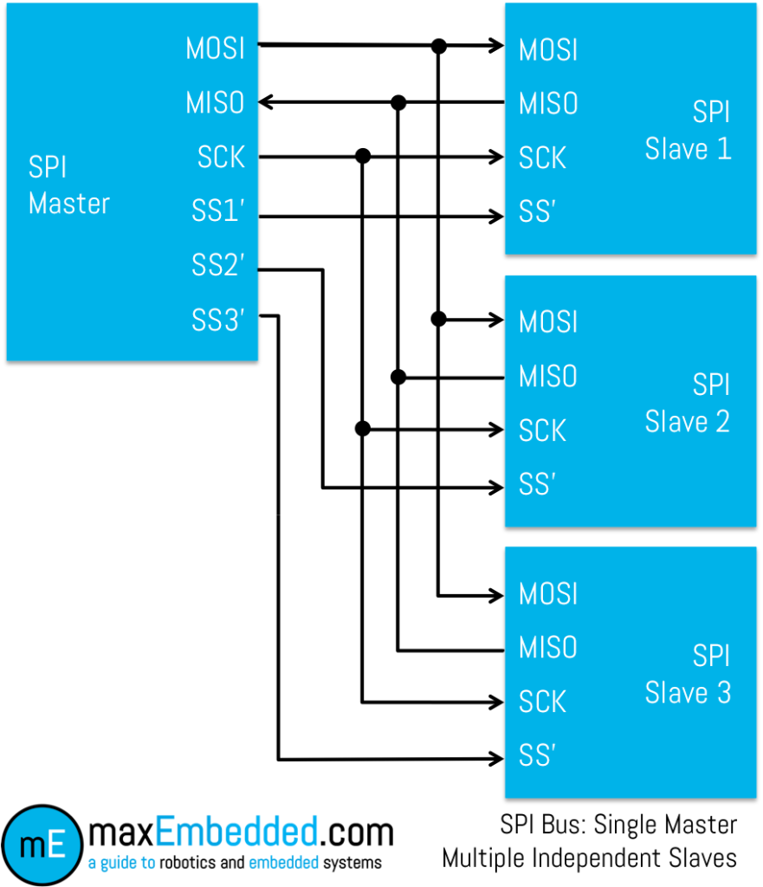
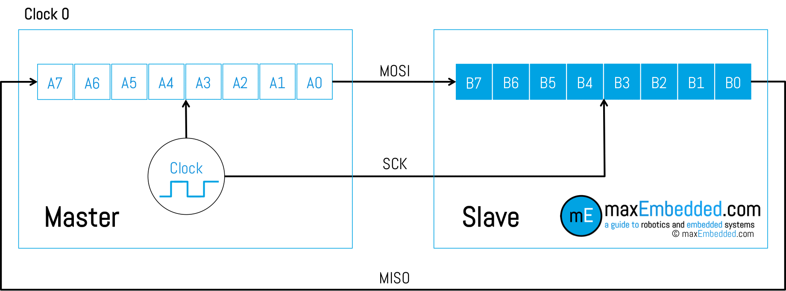
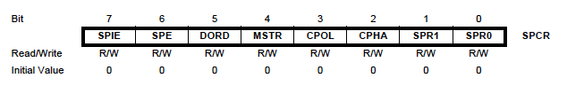
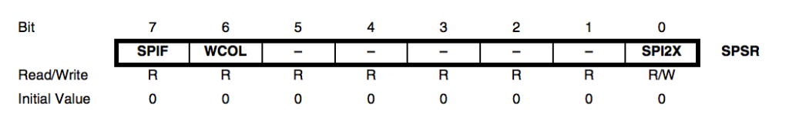
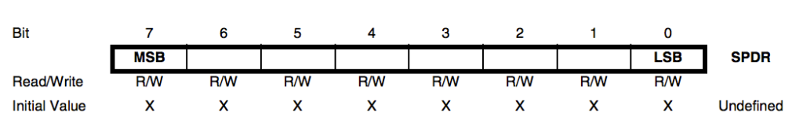
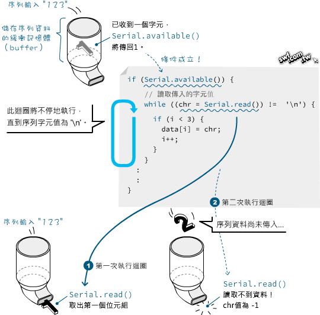
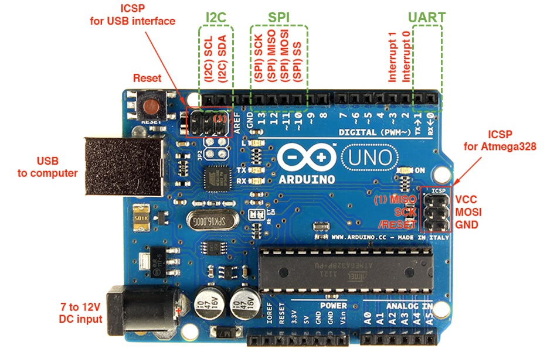
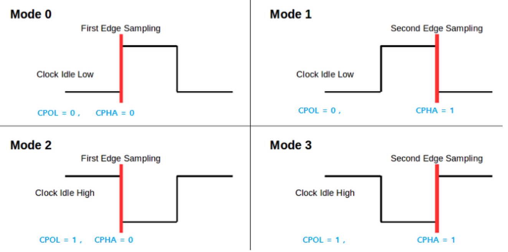

# 單晶片lab3結報
###### tags: `arduino`
###### 實驗日期 : 2021/10/07
## 上課教材
[SPI、藍芽](https://hackmd.io/@9ScCWm6PQhCqJjg8JfJKzQ/SJ2Ig1nVt)

## lab1-1
### SPEC
利用`SPI`進行2個Arduino板子之間通訊，傳送字串`"Hello, world!"`。

### 觀念 - SPI是什麼
請參閱[Serial Peripheral Interface – SPI Basics](https://maxembedded.com/2013/11/serial-peripheral-interface-spi-basics/#SS)與[【Maker電子學】SPI 界面解密—PART 1](https://makerpro.cc/2020/03/spi-interface-part1/)。

在一對多的模式下，所有 SPI slave的`MOSI`、`MISO`、`CLK` 訊號通通都並聯在一起，才與master相接，但最重要的是master必須為每一個slave準備一個`SS`訊號，用這個`SS`訊號來選擇現在是要和哪一個slave溝通。


使用位元暫存器。



### 觀念 - SPI的暫存器
請參閱[The SPI of the AVR](https://maxembedded.com/2013/11/the-spi-of-the-avr/)。
|Register|Function|
|:-:|:-:|
|**SPCR** (SPI Control Register)|This register is basically the **master** register i.e. it contains the bits to **initialize SPI and control it**.|
|**SPSR** (SPI Status Register)|This is the **status** register. This register is used to **read the status of the bus lines**.|
|**SPDR** (SPI Data Register)|The SPI Data Register is the **read/write** register where the **actual data transfer** takes place.|
- The SPI Control Register (SPCR)


|bit|abbr|name|
|:-:|:-:|:-:|
|7|SPIE|SPI Interrupt Enable|
|6  |SPE       |SPI Enable|
|5  |DORD      |Data Order|
|4  |MSTR      |Master/Slave Select|
|3  |CPOL      |Clock Polarity|
|2  |CPHA      |Clock Phase|
|1,0|SPR1, SPR0|SPI Clock Rate Select|

- The SPI Status Register (SPSR)


|bit|abbr|name|
|:-:|:-:|:-:|
|7  |SPIF |SPI Interrupt Flag|
|6  |WCOL |Write Collision Flag|
|5:1|X|X (reserved bits)|
|0  |SPI2x |SPI Double Speed Mode|

- The SPI Data Register (SPDR)

The SPI Data register is an 8-bit read/write register. This is the register from where we **read the incoming data**, and **write the data** to which we want to **transmit**.
<br><br>
we can relate it to **bit 5 of SPCR – the DORD bit**. When DORD is set to 1, then LSB, i.e. the 0th bit of the SPDR is **transmitted first**, and vice versa.

### 實現方法
- master.ino
1. 初始化
```cpp
digitalWrite(SS, HIGH); //SPI內部邏輯復位
SPI.begin(); // SPI通訊初始化配置
SPI.setClockDivider(SPI_CLOCK_DIV8); //set clock
```
2. 選擇線`SS`拉低，enable訊號，傳輸結束再拉高
```cpp
3digitalWrite(SS, LOW); //enable SPI
SPI.transfer(c);
digitalWrite(SS, HIGH);  //disable SPI
```

- slave.ino
1. 初始化
```cpp
SPCR |= bit(SPE); // turn on SPI in slave mode
pinMode(MISO, OUTPUT); //設定主入從出
SPI.attachInterrupt(); // turn on interrupt
```
2. 中斷程序
```cpp
// SPI interrupt routine
ISR(SPI_STC_vect) {
    byte c = SPDR;  // read byte from SPI Data Register
    if (pos < sizeof(buf)) {
        buf[pos++] = c;              // save data in the next index in the array buff
        if (c == '\r') flag = true;  //check for the end of the word
    }
}
```

3. 印出字串<br>
flag為`true`則印出字串，並把flag與pos再次初始化等待下次發生中斷。
```cpp
if (flag) {
    flag = false;
    Serial.println(buf);
    pos = 0;
}
```
## lab1-2
### SPEC
利用`SPI`進行2個Arduino板子之間通訊，2個Arduino板子都分別帶有1個LED和1個按鈕。按下一端的按鈕，使另一端的LED亮起，放開後熄滅。

### 實現方法
與lab1觀念相同。
- master.ino
```cpp
digitalWrite(SS, LOW);
Master_receive = SPI.transfer(Master_send);
digitalWrite(SS, HIGH);
```
master將按鈕觸發高或低的訊息在SS拉低時傳輸給slave。由於`SPI`有`MOSI`、`MISO`兩條訊號線構成全雙工模式，因此[`SPI.transfer(val)`](https://www.arduino.cc/en/Reference/SPITransfer)也會接收到從slave傳回來的訊息。

- slave.ino
```cpp
ISR(SPI_STC_vect) {        //SPI中斷程序
    Slavereceived = SPDR;  //從SPI Data Register獲取資料(byte)
    received = true;
}
```
slave接收到從master傳來的訊息，會進入中斷處理程序(`ISR`, interrupt service routine)，每次從`SPDR`(SPI Data Register)獲取1 byte的資料。
```cpp
SPDR = Slavesend;  //Sends the x value to master via SPDR
```
而當slave按鈕按下，會把值傳給`SPDR`，當master下次將選擇線`SS`拉低時，就會從`Master_receive = SPI.transfer(Master_send);`中讀取slave傳回來的值。

- ref : [如何在两个Arduino开发板之间使用SPI总线进行通信](如何在两个Arduino开发板之间使用SPI总线进行通信)

## lab2-1
### SPEC
Serial Monitor上輸入再透過藍芽傳資料，來控制LED亮暗。
|輸入值|LED反應|
|:-:|:-:|
|`1`|ON|
|`0`|OFF|
|其他|閃爍2次|

### 軟串口觀念
除了HardwareSerial，也就是Arduino Uno預設腳位0是UART的RT、1是UART的TX外，Arduino還提供了`SoftwareSerial`類庫，它可以將其他數字引腳通過**軟體模擬成串口通信引腳**。軟串口是由程序模擬實現的，使用方法類似硬體串口，但有一定局限性，像是brand建議不要超過`115200`bps。相關API文檔請參閱[Serial Communications (SoftwareSerial Class)](https://www.renesas.com/us/en/products/gadget-renesas/reference/gr-adzuki/library-softwareserial)，以下列舉部分語法 :
1. 創建構造函數，指定RX、TX
```cpp
SoftwareSerial(receivePin, transmitPin)
SoftwareSerial(receivePin, transmitPin, inverse_logic)
```

2. 指定傳輸速率(braud)
```cpp
BTSerial.begin(int speed)
```

3. 結束傳輸
```cpp
BTSerial.end()
```

4. 獲取可用於從串口讀取的byte數。
```cpp
int serial.available()
```

5. 等待所有"發送緩存"中數據都發送完畢以後，再執行後續的程序內容。(**注意 : 並非清除開發板接收緩存區**)
```cpp
BTSerial.flush()
```

6. 啟用選定的軟體軟串口進行偵聽。**一次只能監聽一個軟件串口**，並且到達其他端口的數據將被丟棄。除非給定的實例已經在監聽，在調用`listen()`期間**會丟棄任何已經接收到的數據**。
```cpp
bool BTSerial.listen()
```

- ref
1. [Arduino編程進階軟串口通信——SoftwareSerial庫的使用](https://kknews.cc/code/q62mjby.html)
2. [flush - 太极创客](http://www.taichi-maker.com/homepage/reference-index/arduino-code-reference/stream/flush/)

### AT模式觀念
藍牙模組的兩種操作模式:
|名稱|自動連線(automatic connection)|命令回應(order-response)|
|:-:|:-:|:-:|
|又稱|透通模式(transparent communication)|AT模式(AT mode)|
|功能|**只是把RX腳傳入的資料，轉成藍牙無線訊號傳遞出去；或者將接收到的無線資料，從TX腳傳給Arduino**，模組本身不會解讀資料，也不接受控制|**能操控藍牙模組的指令**，只有在AT模式，才能接收AT命令|
|HC-05模式|與其他裝置連線時|與其他裝置連線外|
|HC-06模式|一般情況|在通電之前，先把KEY腳位（藍牙模組本身的34腳）接在高電位（通常指3.3V，但是接5V也行）|

AT指令列表可參閱[HC-05 Bluetooth AT Command List](https://www.teachmemicro.com/hc-05-bluetooth-command-list/)。

- ref : [HC-05與HC-06藍牙模組補充說明（三）：使用Arduino設定AT命令](https://swf.com.tw/?p=712)
 
### 實現方法

```cpp
if (Serial.available()) {
    val = Serial.read();
    BTSerial.write(val);
    /*led blink*/
}
```
硬體與軟體實作是錯誤的，硬體部分我們只用一個藍芽模組，這樣藍芽傳出資料，而沒有接收端接收無線訊號，而軟體部分如上是直接用資料進行運算。

應該要使用個別裝上藍芽模組的Arduino板子、分兩份程式碼燒錄至板子進行發射與接收傳輸，並在接收端利用變數`val`進行判斷，改變燈泡的閃亮。

## lab2-2
### SPEC
Serial Monitor上輸入再透過藍芽傳資料，控制五顆LED跑馬燈。
|輸入值|LED反應|
|:-:|:-:|
|`0`|暫停|
|`1`|跑馬燈|
|`2`|每次間隔一顆暗的|
|`3`|右->左點亮、左->右熄滅|
|`4`|全亮|
|其他|全部閃爍|


### 實現方法
如[lab2-1的問題](#實現方法2)。

## lab3-1
### SPEC
手機終端機輸入再透過藍芽傳資料，顯示於四位七段顯示器，實現碼錶功能。
|輸入值|功能|
|:-:|:-:|
|`1`|計時開始/暫停|
|`0`|計時歸0|

### 實現方法
安卓手機下載[Serial Bluetooth Terminal](https://play.google.com/store/apps/details?id=de.kai_morich.serial_bluetooth_terminal&hl=en&gl=US)，在程式的終端機輸入值，並發射無線藍芽訊息，

## lab3-2
### SPEC
手機終端機輸入再透過藍芽傳資料，實現密碼鎖功能。
|輸入值|功能|
|:-:|:-:|
|`B`|進入密碼重設模式，並自訂一個密碼(ex:`1258`)|
|輸入一組**正確**密碼(ex:`1258`)|顯示剩錯誤次數，印出`Unlock!`|
|輸入一組**錯誤**密碼(ex:`1255`)|顯示剩錯誤次數，印出`Wrong passwords!`，若連續錯誤3次，**等待10秒**(顯示倒數數字)才能再次輸入|

### 實現方法
```cpp
BTSerial.begin(38400);
```
設定藍牙模組`HC-05`，與AT命令模式時設定或是預設之連線速率保持一致。

```cpp
if (BTSerial.available()) {
        val = BTSerial.read();
        //Serial.print(val);
    }
```
若**收到藍牙模組**的資料，則送到"序列埠監控視窗"。

```cpp
if (val == 'B')
        reset_mode = true;
```
分2種case :
第1種case為讀入`B`則將`bool reset_mode`這個flag設為`true`。

```cpp
while (reset_mode) {
    if (BTSerial.available()) {
        // 讀取傳入的字元值
        while ((val = BTSerial.read()) != '\n') {
            // 確認字元值不等於-1，而且索引i小於4（確保僅讀取前4個字）
            if (val != -1 && count < 4 && val != '\r') {
                password[count++] = val;
            }
        }
    }
}
```
輸入`B`後進入`reset_mode`，檢查藍芽緩衝區有無新輸入的值，若有則讀值，讀到出現換行`\n`為止。使用換行`\n`是因為手機藍芽發射端行結束符設定為`CR`(`\r`)+`LF`(`\n`)的規定，以此判斷中止字串。

最裡層那個`if`迴圈需要排除前面的回車`\r`再加上`-1`的條件，並確保僅讀取前4個字。這是因為當程式察覺到有序列資料進入時，就開始連續讀取4個字元。可是**序列資料的傳入速度遠不及程式迴圈的執行速度**，所以存入data陣列的第2和第3個元素值都是`-1`(代表序列埠沒有輸入值)。



```cpp
while (isDigit(val)) {
    input[count++] = val;
    if (BTSerial.available()) {
        /*讀取並儲存傳入的字元*/
    }
}
```
第2種case為判斷讀入是否為數字，先將第一個讀到並在`val`值存到陣列裡面，其餘操作與第一個case相同。

```cpp
if (BTSerial.available()) {
    BTSerial.read();
}
```
最後需要注意的點是當錯誤超過3次等待10秒期間，如果使用者在這段時間在手機端亂輸入值，將會存到藍芽模組`HC-05`的buffer，使得10秒過後，`BTSerial.available() == 1`，而讀入非預期之數值，因此需要清空這些在buffer的值。

關於密碼鎖功能實踐請參閱[單晶片lab2結報lab1、lab2-1](https://hackmd.io/@arduino/report-2#lab1)，不再贅述。

---

- **換行規定需自行設定**，常見判斷換行有規則有 :

|OS|行結束符|
|:-:|:-:|
|Windows|`\r\n`|
|Mac|`\r`|
|Unix|`\n`|

|控制字符|`\r`|`\n`|
|:-:|:-:|:-:|
|名稱|CR (Carriage Return)|LF (Line Feed)|
|譯名|回車|換行|
|ASICII碼|13|10|
|功能|使游標到行首|使游標下移一格|

> 歷史典故 : 在計算機還沒有出現之前，有一種叫做電傳打字機(Teletype Model 33，Linux/Unix下的tty概念也來自於此)，每秒鐘可以打10個字元。但是它有一個問題，就是打完一行換行的時候，要用去0.2秒，正好可以打兩個字元。要是在這0.2秒裡面，又有新的字元傳過來，那麼這個字元將丟失。<br><br>
於是，研製人員想了個辦法解決這個問題，就是在每行後面加兩個表示結束的字元。一個叫做“回車”，告訴打字機把列印頭定位在左邊界；另一個叫做“換行”，告訴打字機把紙向下移一行。這就是“換行”和“回車”的來歷，從它們的英語名字上也可以看出一二。<br><br>
後來，計算機發明，這兩個概念也就被搬到了計算機上。那時，儲存器很貴，一些科學家認為在每行結尾加兩個字元太浪費了，加一個就可以。於是就出現了分歧。

---
- ref
1. [關於行結束符（CR、LF）](https://codertw.com/%E7%A8%8B%E5%BC%8F%E8%AA%9E%E8%A8%80/36265/)
2. [Arduino序列埠通訊程式Serial.read()讀取到 ÿ 字元的補充說明](https://swf.com.tw/?p=729)

## 課後習題
### Question 1
請簡述 `URAT`、`I2C`、`SPI`三介面之優缺點。

### Answer 1

|介面|優點|缺點|
|:-:|:-:|:-:|
|UART|線路簡單，**兩條線路TX、RX進行一對一傳輸**|因為僅有兩線路，**傳輸速度慢**，最高僅115.2kbps，不能用高速大量傳輸作業上|
|I^2^C|線路簡單，僅兩條傳輸線路，分別為**時脈、傳輸**所用。不同於UART，可同時**連接多個裝置**，而且允許**多個主控端**，且傳輸速度比UART快|傳輸距離短。由於傳輸是同一條線，**不能同時傳輸、接收**。|
|SPI|可接多個裝置。傳輸速度比I^2^C快。可**同時傳送、接收**。|至少需要4條連接線，且**線路會隨裝置增加而增加**。僅限一個主控端。|

- ref : [【Maker進階】認識UART、I2C、SPI三介面特性](https://makerpro.cc/2016/07/learning-interfaces-about-uart-i2c-spi/)

### Question 2
SPI mode的用途為何?為何設計4個mode?請詳細說明

### Answer 2
SPI的`SCLK`號線有兩種特性，存在於SPI Control Register SPCR)中，bit3的`CPOL`(Clock Polarity)、bit4的`CPHA`(Clock Phase)，分別可以為0、1，組合出4種mode，如下表所示 :


- `CPOL` : 為clock level，當訊號線SCLK `LOW->0`、`HIGH->1`。
- `CPHA` : 為clock edge，當訊號線SCLK `leading edge->0`、`trailing edge->1`。

|SPI Mode|CPOL|CPHA|
|:-:|:-:|:-:|
|Mode 1|0 (LOW) |0 (leading edge)|
|Mode 2|0 (LOW) |1 (trailing edge)|
|Mode 3|1 (HIGH)|0 (leading edge)|
|Mode 4|1 (HIGH)|1 (trailing edge)|


SPI同步傳輸資料可藉由`MISO`、`MOSI`這兩條線傳送，其傳輸方式是將master、slave之內部暫存器進行資料交換，當`SCLK`某個edge觸發，則交換1 bit資料。4個mode的原因，SPI就由`SCLK`控制，進行高速傳輸，在不同設備要互相通訊，其對應的mode也會不同，會有**反邏輯**的狀況，需要`CPOL`的特性，而**資料的穩定時間**也有所不同，所以需`CPHA`的特性，綜合而言，SPI給出4個mode是為了**增加時序的彈性**。

- ref : [Back to Basics: SPI (Serial Peripheral Interface)](https://www.allaboutcircuits.com/technical-articles/spi-serial-peripheral-interface/)

### Question 3
請說明`HC-05`作為master以及slave的功用是什麼?

### Answer 3
在`AT`模式時，輸入`AT+ROLE` = `0(slave)`或 `1(master)`，決定此藍牙模組的主從性。
- 設為`slave mode`時，只能**等著被主機(host)搜尋並連接**，並不能主動搜尋。與主機連機後，則可互相傳輸訊息。
- 設為`master mode`時，**可以主動搜尋設備**，連接其他附近的slave裝置，理論上可以同時連接7個slave，

- ref : [What is the difference between the master mode and the slave mode of the Bluetooth serial port module?](https://www.linkedin.com/pulse/what-difference-between-master-mode-slave-bluetooth-anne)

## 心得
### 劉永勝
實驗內容是學習利用`SPI`介面，讓主從機傳遞訊息。
- 實驗一為兩塊uno板，一個做為master，另一個做為slave互相控制對方的輸出，理論上slave的電源已經從master端供給，但我們實作時，**兩塊uno板皆須個別連接電腦才能使用**，我認為可能是uno板在溝通時，必需經過serial port才可以傳輸資料。
- 實驗二是用藍芽模組作為slave，再與uno板傳輸資料，講義上啟動AT模式的方法可能有誤，**僅需連接key port就可以啟動，不須額外按按鈕**。

### 李宇洋
這次實驗主要是學會利用`SPI`介面從主端和從端互相傳送資訊，具體`SPI`在code上的操作方式還是沒有很了解，會再多熟悉如何使用。藍芽的部分在此次實驗主要遇到的問題是如果**沒有把Arduino接上`HC-05`的key腳位會無法進入AT mode**，無論按了`HC-05`上的按鈕多久都沒辦法進入AT mode，因此我們在這個部分也卡住了一段時間，剩下的部分因為主要是之前lab的內容所以比較沒有什麼問題。

### 陳旭祺
本次重點為了解`SPI`傳輸協定與藍芽模組`HC-05`的使用。
無線傳輸是一個很有趣的主題，主要分為3大類 : 
|類型|模組|
|:-:|:-:|
|藍芽|`HC-05`、`HC-06`|
|無線電|`NRF24L01`|
|WIFI|`ESP8266`|

我目前想研究一下WIFI模組`ESP8266`並透過server傳資料到客戶端line bot，感覺很有趣。

---

另外上了工設系2小時的課，老實說自己沒有學到什麼很實質上的收穫，不過還是大致歸納出以下重點 :
- 設計思考

|流程|說明|
|:-:|:-:|
|Empathy|以使用者為中心的設計，透過多元的方式了解使用者|
|Define|經過「架構」、「刪去」、「挖深」、「組合」後（可交互使用），對問題重新的作更深入的定義，更進一步找出使用者真正的需求，並用簡短的一句話定義使用者的需求|
|Ideate|以廣度為重心發展各種方案的可能性，透過三不五要的原則，激發出腦內無限的創意點子|
|Prototype|建立原型的過程加強思考和溝通|
|Test|做測試進以了解這個方案以及用戶|

- **發散與收斂**<br>
沒有想法時，發散問題，什麼想法都可以，最後再從中篩選結果，進行收斂。