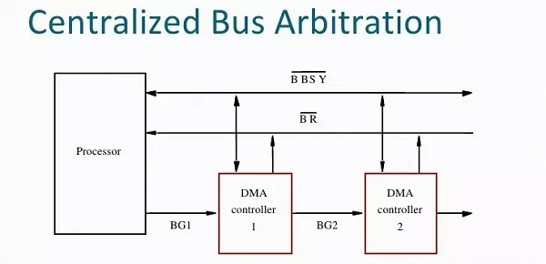
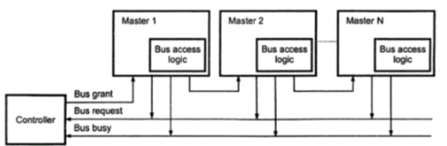
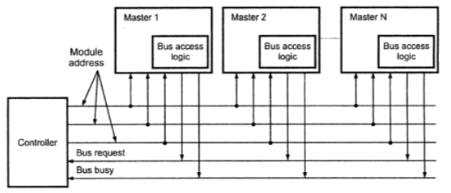
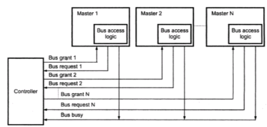
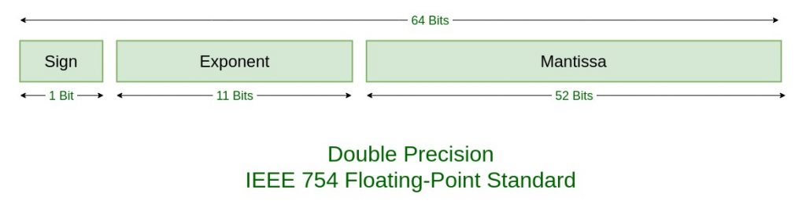

# 單晶片lab4結報
###### tags: `arduino`
###### 實驗日期 : 2021/10/14
## 上課教材
- [I^2^C、LCD、四則運算](https://hackmd.io/@mzTjnf74ST6xKOB4FrGblQ/SksjSGqWK)

## lab1
### SPEC
利用I^2^C進行Arduino間通訊。


### 實現方法
完整I^2^C原理參見[lab4課後習題
Question 1](#Question-1)，`Wire.h`的使用實例參見[lab2課後習題 Question 4](https://hackmd.io/2coEqM37QrSNsro2JQl6Qg?view#Question-4)。

- master.ino
```cpp
Wire.begin();
```
初始化`Wire.h`，未指定7-bit slave地址則為加入者為master。
```cpp
if (Serial.available()) {
    Wire.beginTransmission(SLAVE_ADDRESS);
        while (Serial.available()) {
            Wire.write(Serial.read());
            delay(10);
        }
    Wire.endTransmission();
    }
```
當serial port有資料時，開啟slave地址，並讀入serial port的資料並送出資料到I^2^C的bus，最後再結束傳輸。

- slave.ino
```cpp
Wire.onReceive(handler)
```
當slave接收到master的傳輸[觸發中斷程序](https://www.arduino.cc/en/Reference/WireOnReceive)，會被呼叫的由使用者自定義的函數。根據源碼`void onReceive( void (*)(int) );`，handler是使用function pointer實踐。
```cpp
void myHandler(int numBytes){
    Serial.println("Receive Data:");
    while (Wire.available()) {
        Serial.print((char)Wire.read());
    }
    Serial.println("");
}
```
在這中斷程序，一開始會接受到從master讀入byte的個數`int numBytes`。`Wire.available()`會回傳可讀byte數，由於布林函數`0`以外的數字皆為正，因此Wire有資料會依序讀入Wire的資料到serial port並印出，直到`Wire.available()`回傳0，代表可讀的byte為0，才結束中斷程序。

## lab2
### SPEC
自己的學號字串以LCD跑馬燈顯示。

### 實現方法
熟悉16×2 I^2^C LCD模組使用，與`<LiquidCrystal_I2C.h>`函式庫成員函數的調用。參閱函式庫介紹[How to control a character I2C LCD with Arduino](https://www.makerguides.com/character-i2c-lcd-arduino-tutorial/)。
|函數|作用|
|:-:|:-:|
|LiquidCrystal_I2C lcd(addr, col, row)|創建物件|
|lcd::init()|初始化|
|lcd::backlight()|開啟背光|
|lcd::begin(cols, rows);|定義LCD的長寬(n列×n行)|
|lcd::clear()|清空LCD|
|lcd::setCursor(col, row);|設定輸入值起始位置|
|lcd::print(text string);|在螢幕上顯示資料|
|lcd::scrollDisplayRight();|將畫面向右捲動，可搭配delay()使用|
|lcd::scrollDisplayLeft();|將畫面向左捲動，可搭配delay()使用|
|lcd::home()|使光標移至左上角|
|lcd::cursor()|顯示光標|
|lcd::noCursor()|關閉上一個功能|
|lcd::blink()|顯示一整塊長方形方格的光標|
|lcd::noBlink()|關閉上一個功能|
|lcd::display()|顯示所有print到LCD的東西|
|lcd::noDisplay()|關閉上一個功能|
|lcd::write()|與print()不同點在於是直接寫進LCD，而非人所看到的資料，例如`lcd.write(64);`是印ASCII Code 64號的`@`符號到LCD上|
|lcd::autoscroll()|下一位輸入值會把前一位輸入值往旁邊一個推|
|lcd::noAutoscroll()|關閉上一個功能|
|lcd::leftToRight()|之後的文字會從光標右邊開始寫|
|lcd::rightToLeft()|之後的文字會從光標左邊開始寫|
|lcd::lcd.createChar(custom characters, byte[]);|先自定義5 x 8 led matrix的像素點陣列，並重新定義字元|
- 自定義LCD字符範例
```cpp
// Make custom characters
byte Heart[] = {
    B00000,
    B01010,
    B11111,
    B11111,
    B01110,
    B00100,
    B00000,
    B00000
};

// Create new characters
lcd.createChar(0, Heart);

//use the number of the custom character that we want to display
lcd.setCursor(0, 1);
lcd.write(0);
```

## lab3
### SPEC
利用keypad與LCD實現二項加減乘除。

### 實現方法
此部分為lab4功能的子集合。

## lab4
### SPEC
利用keypad與LCD實現四則運算計算機。
|輸入值|功能|
|:-:|:-:|
|`A`|$+$|
|`B`|$-$|
|`C`|$\times$|
|`D`|$\times$|
|`#`|$=$|
|`*`|清除|

### 實現方法
1. 讀值
```cpp
if (enter == '#') {
    infix[count] = '\0';
    break;
} else if (enter == 'A') {
    infix[count] = '+';
```
當有輸進值`enter != NO_KEY`時，對輸入字串進行替換，以符合原始資料，並顯示在LCD上`lcd.print(infix[count]);`，當出現`#`則代替為終止字符，並跳出無窮迴圈。

2. 計算
```cpp
double pfix_parser(char *ifix);
```
四則運算為資料結構(DS)介紹stack功能章節實作。
- infix轉postfix<br>
    - 目的 :<br>
    不用處理運算子先後順序問題，只要依序由運算式由前往後讀取即可。
    - 方法 : 取出中序式的字元
        1. 遇運算元直接輸出。(在字元結尾插入`'n'`因此可接受多位數值)
        3. 堆疊運算子與左括號`(`。
        4. 堆疊中運算子**優先順序若大於**等於讀入的運算子優先順序的話，直接輸出堆疊中的運算子，再將讀入的運算子置入堆疊。
        5. 遇**右括號`)`輸出**堆疊中的運算子至左括號`(`。

- postfix轉value<br>
把運算元push進或pop出stack直接計算。

## 課後習題
### Question 1
簡述I^2^C如何藉由`SCL`與`SDA`傳送資料 ?

### Answer 1
I2C 是序列式的傳輸，只有兩條線，一條叫做`SDA`送資料，另一條叫做`SCL`傳clock。
```cpp
Wire.begin(); 
//初始化Wire.h並作為master or slave加入I2C bus
//如未指定7-bit slave地址(函數重載)，則為加入者為master
Wire.beginTransmission(SLAVE_ADDRESS); 
//傳slave地址
```
1. 傳slave地址，決定跟哪個slave溝通
    - Start condition：`SCL=high + SDA falling`。
    - **傳7-bit地址**，因此最大可以有128個slave(但實際上有16個系統擴充位址是保留的)。
    - **第8個bit傳`R/W bit`**，指定要讀(0：write)或寫(1:Read)資料。
    - Stop condition：`SCL=high + SDA raising`。
2. Slave `ACK`一次確認<br>
    - `SDA`主動權由master交給slave控制。
    - 如果有**成功收到**先前的訊號**slave要把SDA拉低**。
```cpp
Wire.write(INNER_REGISTER_ADDR); //指定slave內部寄存器地址
```
3. Slave內部暫存器地址
    - Start condition：`SCL=high + SDA falling`。
    - 傳送8-bit地址。
    - Stop condition：`SCL=high + SDA raising`。
4. Slave `ACK`一次確認
    - `SDA`主動權由master交給slave控制。
    - 如果成功有收到先前的訊號slave要把`SDA`拉低。
```cpp
Wire.write(0); //寫入1個byte的數據
Wire.endTransmission(false);
//If false, endTransmission() sends a 
//restart message after transmission.
Wire.requestFrom(SLAVE_ADDRESS, DATA_SIZE, true);
if (Wire.available()) {
    Serial.print("Data returned: ");
    while (Wire.available()) {
    //return the number of bytes available for reading.
        Serial.print( (char)Wire.read() );
    }
  Serial.println();
}
Wire.endTransmission(); //結束傳輸
```
5. 傳送data
    - Start condition：`SCL=high + SDA falling`。
    - 由前面`R/W bit`去判斷資料要傳送還是發送，每次傳送8-bit資料。
    - 如果未傳輸完，則由下一次再繼續傳8-bit。
    - Stop condition：`SCL=high + SDA raising`。
6. Slave `ACK`一次確認
    - `SDA`主動權由master交給slave控制。
    - 如果成功有收到先前的訊號slave要把`SDA`拉低。
7. 結束傳輸
    - `SCL`先拉高，隨後`SDA`跟著拉高。


- 資料來源 : [How I2C Communication Works and How To Use It with Arduino](https://www.youtube.com/watch?v=6IAkYpmA1DQ)
### Question 2
上課的時候提到可以有多個master，請問若同時有兩個以上的master送出訊號會發生什麼事？並且描述該如何解決。

### Answer 2
在各種bus arbitration機制中，最基本的禮貌就是"先聽再說"：當你要說話時，先聽聽有沒有別人在說話，如果有的話就閉嘴，如果沒有別人在說話，你才可以說話。根據 I^2^C 的規格說明，需要兩個機制：時脈同步(clock synchronization)和匯流排仲裁(bus arbitration)。
- **時脈同步(clock synchronization)**<br>
時序可分為兩種master clock和slave clock，而在時脈同步系統中，master經由網路伺服器、GPS接收器等裝置得到準確時序，再將此時序連接到各個slave端，以確保整個系統的時序是精準且同步的。master一天之中會多次更新時脈訊號給slave，避免slave時序延遲。

- **匯流排仲裁(bus arbitration)**<br>
在匯流排中用於初始化資料傳輸的裝置稱為**主匯流排(bus master**)。當一個系統會有超過一個主匯流排時，這些裝置間會互相分享匯流排系統，即當目前的主匯流排已經交出主導權時，其餘的匯流排可以獲得處理器的控制權，bus仲裁即為主匯流排間互相交換主控權的過程。<br>
其中有兩種Bus仲裁方式，分別為 :
    1. **集中式仲裁(Centralised Arbitration)**
    <br>
    只有一個匯流排會負責執行仲裁，這個匯流排有可能是處理器或是連接至匯流排的控制器，集中式仲裁主要有三個方式：<br>
        - **菊鍊(Daisy Chaining)**：<br>
<br>
所有主匯流排裝置都使用同一條線路去向仲裁裝置(在此圖為控制器)請求控制權，假設匯流排是空閒的情況則仲裁會回傳**允許控制匯流排系統(bus grant)** 的資訊，此資訊會從線路回傳並經過沿路的主匯流排裝置，直到遇到第一個發出控制權請求的裝置。此時這個主匯流排裝置會阻擋bus grant訊號的傳遞，並且啟動**bus busy線路**後獲取控制權。
<br><br>
        - **輪詢法(Polling Method)**:<br>
<br>
仲裁裝置(在此圖為控制器)在此方法中主要用於為主匯流排產生address，而**位址線路(address line)** 的數量取決於連接至此系統的主匯流排數量。舉例來說，假設有8個連接至系統的主匯流排，則至少需要3個位址線路。<br><br>
仲裁裝置會根據發出請求的匯流排產生一組的主匯流排位址，而若發出請求的主匯流排認得此位址，則他就會啟動bus busy線路並開始使用匯流排系統。
<br><br>
        - **獨立請求(Independent Request)**:<br>
<br>
在此方法中每組主匯流排都有各自獨立的請求線路和獲取線路，其中每組匯流排系統都有各自分配的優先權，仲裁裝置(在此圖為控制器)會有內建的優先權解碼器，並且會選取最高優先權的請求，然後允許此主匯流排控制匯流排系統。
<br><br>
    2. **分散式仲裁(Distributed Arbitration)**
    <br>
    所有裝置會被列為可能選擇的下一個主匯流排，並被各自分配4-bit的識別數字，假設有一或多個裝置請求匯流排系統的控制權，則他們會斷言(assert)**開始仲裁(start-arbitration)** 的信號並且把識別數字輸出到仲裁線路上(由ARB0到ARB3)，由於4條仲裁線路都是Open-Collector，因此即便有一個以上的裝置也一樣可以輸出自己的4-bit識別碼。若有一個裝置要把1輸出到bus line上、另一個要輸出0到同個線路時，bus line的狀態會為0。
<br><br>
裝置會透過inverter buffer讀取每個仲裁線路的狀態。(因此若讀取到bus line狀態為0，則會轉為1)假設同時有兩個或以上的裝置放置識別數字在bus line上時，則需要透過bus line的狀態辨別出最高順位的識別數字。
<br><br>
舉例來說：假設裝置A的數字為1 (0001)，裝置B的數字為6 (0110)且兩裝置同時請求使用匯流排，將兩者訊號輸出後會發現bus line的狀態為1000，但透過inverter buffer兩個裝置會看到狀態為0111。此時兩個裝置會自己比較這個code和自身辨別數字的不同(**從最高有效位開始**)，若裝置發現**有哪個部分不同**(A:0001 <-> bus:0111)，則會關閉從這個bit到最低位bit的輸出，將這些部分全部輸出0(以圖片而言，即為A裝置從ARB2關閉至ARB0)，因此A裝置會輸出0000(invert後變成1111)，則此時bus line狀態變為1001(兩裝置看到的為0110)，因此最後判定裝置B獲得主控權。
<br><br>
這種去中心化的仲裁系統擁有很高的可靠性，因為他不會取決於任何一個單一裝置。

- ref :
1. [【Maker電子學】I2C 界面解密 — PART 6 仲裁協定](https://makerpro.cc/2020/07/i2c-interface-part6/)<br>
2. [What is bus arbitration? Explain any two techniques of bus arbitration. OR Explain Bus Contention and different method to resolve it](https://www.ques10.com/p/8794/what-is-bus-arbitration-explain-any-two-techniqu-2/?)<br>
3. [SYNCHRONIZED CLOCK SYSTEMS EXPLAINED](https://sapling-inc.com/synchronized-clock-systems-explained/)

### Question 3
電算機為何總和超過`32767`時字串會溢位?如何解決?
### Answer 3
Arduino中，`int`的資料型態為`signed 16bits`，因此當數值超過$2^{15} = 32,768$時，會發生overflow。解決方法是變更資料型態為`float`、`double`、`long`。

---
Arduino中常見的資料型態 :
|  資料型態    |      說明     |  記憶體長度 |              數值範圍              |
|:----------:|:-------------:|:---------:|:---------------------------------:|
|   `boolean`|      布林     |   8  bits  |  true   (1, HIGH), false(0, LOW)  |
|    `byte`  |     位元組    |   8   bits  |               0~255              |
|    `char`  |      字元     |   8  bits  |              -128~127             |
|   `short`  |     短整數    |   16  bits  |           -32768~32767           |
|    `word`  |       字     |   16   bits |              0~65535             |
|    `long`  |     長整數    |   32   bits |       -2147483648~2147483647     |
|    `float` |     浮點數    |   32   bits |          +-3.4028235e+38         |
|   `double` |  倍精度浮點數  |   32   bits |          +-3.4028235e+38         |


double與float皆相同，根據[官方doc](https://www.arduino.cc/reference/en/language/variables/data-types/double/)定義
> **Double precision floating point number**. On the Uno and other ATMEGA based boards, this occupies 4 bytes. That is, **the double implementation is exactly the same as the float**, with no gain in precision.
<br><br>
On the Arduino Due, doubles have 8-byte (64 bit) precision.


雙浮點精度由3個部分包含 :
|組成|功能|
|:-:|:-:|
|sign bit (符號)|正負號|
|exponent (指數)|次方數|
|mantissa (尾數)|精確度|

## 心得
### 劉永勝
I^2^C傳輸協定，在之前用`MPU6050`時，已有簡單的討論，其優點在於接線數較少，實作中遇到了一些內建函數回傳值的問題，輸出回傳值後即了解，slave端接收訊號時，會計算接收位元組數進行回傳。

LCD的部分，相較於七段顯示器，LCD較好操作。LCD模組配有掃描式驅動IC，並配合每pixel之電容，可讓面板上的數值持續顯示，不像七段顯示器要用迴圈的方式才能使數值常駐顯示。而四則運算的原理，在資料結構中有學過，先將輸入字元重新排列後，再以push、pop的方式處理。直接使用資料結構之程式碼，在調整LCD顯示問題即可完成。

### 李宇洋
此次實驗為操作LCD與利用I^2^C進行Arduino間通訊，使用的是`Wire.h`函式庫，比較上次實驗是利用SPI進行通訊，主要使用的函式庫式是`SPI.h`。因為LCD本身有自定義的函式庫，只需要事先利用`LiquidCrystal_I2C.h`函式庫設定LCD位址，再把需要顯示的字元print出就可以顯示在螢幕上。

### 陳旭祺
做個小整理。<br>
延續[lab2學UART](https://hackmd.io/@G8HrHAUqQyCt9mHFYW05UA/rJSzxDQ-K#UART-Protocol)(Serial Monitor)、[lab3學SPI](https://hackmd.io/@9ScCWm6PQhCqJjg8JfJKzQ/SJ2Ig1nVt#Introduction-of-SPI)(傳字串)，這次[lab4學I^2^C](https://hackmd.io/@mzTjnf74ST6xKOB4FrGblQ/SksjSGqWK#Introduction-of-I2C)(傳字串)三大傳輸協定是算是告一段落，原理介紹文章可參閱[【Maker 電子學】作者Bird](https://makerpro.cc/author/birdlg/)，而對應相關模組 :
|介面|外接線|模組|
|:-:|:-:|:-:|
|UART|RX(接收)、TX(發送)|藍芽HC-05(lab3)|
|I^2^C|SDA(資料)、SCL(時脈)|三軸陀螺儀與三軸加速計`MPU6050`(lab2)、顯示器LCD(lab4)|
|SPI|MOSI(主出從入)、MISO(主入從出)、SCLK(時脈)、SS(選擇1)、SS2(選擇2)...|無|

3者對應使用到的函式庫 : 
- [`<SoftwareSerial.h>`](https://www.arduino.cc/en/Reference/softwareSerial) enables serial communication with a digital pin other than the serial port.The native serial support happens via a piece of hardware (built into the chip) called a UART.
- [`<Wire.h>`](https://www.arduino.cc/en/reference/wire) communicate with I2C / TWI devices.
- [`<SPI.h>`](https://www.arduino.cc/en/reference/SPI)
communicate with SPI devices, with the Arduino as the master device.