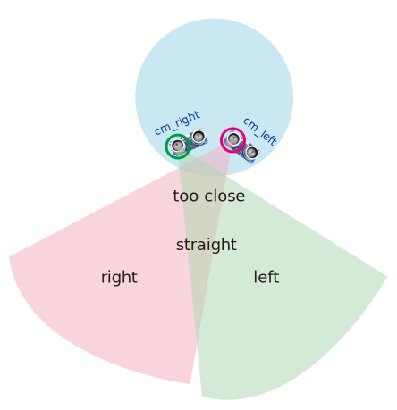
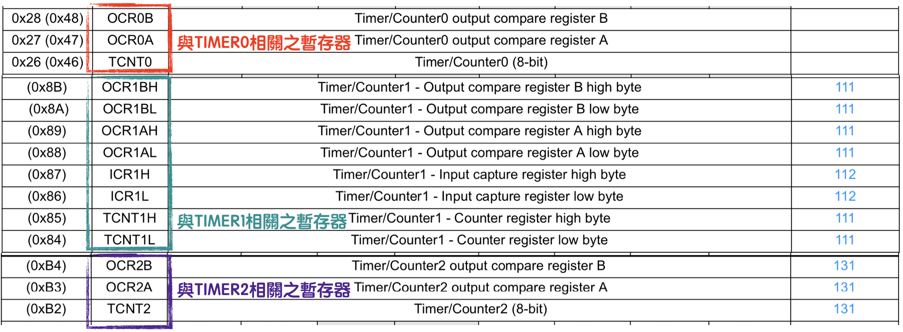
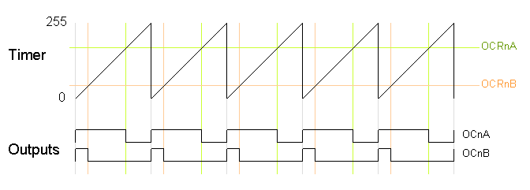
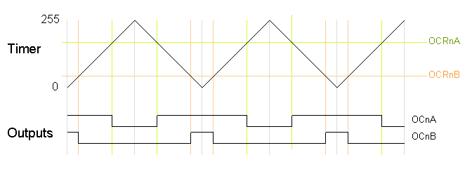

# 單晶片lab6結報
###### tags: `arduino`
###### 實驗日期 : 2021/10/28
## 上課教材
- [自走車](https://hackmd.io/@nsyRI3v6SuG6fKQFyi9Ugg/H1c5B8dHF)

## lab1
### SPEC
當距離越近，duty cycle越高。
- 使用PWM，數位訊號高頻率的切換來模擬類比訊號
- 使用超音波模組測距離
- 使用示波器測量duty cycle
- I^2^C LCD顯示距離

### 實現方法
如[Arduino官方doc](https://www.arduino.cc/reference/en/language/functions/analog-io/analogwrite/)
```cpp
analogWrite(pin, value)
```
|parameter|function|data type|
|:-:|:-:|:-:|
|pin|the Arduino pin to write to|`int`|
|value|the duty cycle: between 0 (always off) and 255 (always on)|`int`|

---

```cpp
cm = (duration / 2) / 29.1;
duty_cycle = 255 - (255 / 20) * cm;
```
將時間換算成距離，再mapping到 $x \in [0,1,2, ......,255]$ 的整數空間(`analogWrite`參數只接受整數的資料型態)，例如最小值`0`對應是`255`，最大值`20`對應是`0`。

## lab2
### SPEC
利用2個超聲波模組測方位，當物體在50公分內，將測得方位(前、左、右、太近)顯示於LCD上。

### 實現方法
為[lab4實現方法](#實現方法3)的子集合，由於組裝超音波模組位置擺放不同，加上左右接收與發射端不對稱，因此藉由trial and error，不斷嘗試找到合適參數。

最終找到合適的條件如下 :
```cpp
if (cm_right < 20 && cm_left < 20) {
    Serial.println("too close");
} else if (cm_right > (cm_left + 30) && cm_left < 50) {
    Serial.println("right");
} else if (cm_left > (cm_right + 10) && cm_right < 50) {
    Serial.println("left");
} else if ((cm_left < 100 || cm_right < 100) && abs(cm_right - cm_left) <= 10) {
    Serial.println("straight");
} else {
    Serial.println("non of objected detected");
}
```

## lab3
### SPEC
利用`L298N`各別控制左右2個馬達完成正轉、反轉、停止功能。
|序列視窗輸入|車子|
:-:|:-:|
|`w`|前進|
|`a`|左轉|
|`d`|右轉|
|`s`|後退|
|`q`|停止|

### 實現方法
為[lab4實現方法](#實現方法3)的子集合，序列視窗輸入功能為個人加入的SPEC，方便控制與測試。

- `L298N`控制訊號(`ENA`, `ENB`可用PWM來改變馬達轉速)

|DC moter |轉向|IN1|IN2|ENA(PWM)|IN3|IN4|ENB(PWM)|
|:-------:|:--:|:-:|:-:|:-:|:-:|:-:|:-:|
|M1	      |正轉|H|L|H|-|-|-|
|M1	      |反轉|L|H|H|-|-|-|
|M1	      |停止|L|L|H|-|-|-|
|M2	      |正轉|-|-|-|H|L|H|
|M2	      |反轉|-|-|-|L|H|H|
|M2	      |停止|-|-|-|L|L|H|

舉例來說 : 若要讓車子向前，要使兩端馬達正轉，並給定合適的轉速PWM寫入。
```cpp
// 決定轉動方向
digitalWrite(LEFT1, HIGH);
digitalWrite(LEFT2, LOW);
digitalWrite(RIGHT1, HIGH);
digitalWrite(RIGHT2, LOW);
// 向馬達輸出指定的類比電壓值
motor_speed = 150;
analogWrite(LEFT_PWM, motor_speed);
analogWrite(RIGHT_PWM, motor_speed + 30);
// 實際上給定PWM，2端輪子轉速不一致，因此需要有offset = 30的誤差修正
```

## lab4
### SPEC
利用2個超音波模組、`L298N`控制2個馬達轉動，實作**跟隨自走車**。

|跟隨物位置|自走車反應|
:-:|:-:|
|太靠近時|後退|
|在右|右轉|
|在左|左轉|
|前方一定範圍|向前|
|沒有物件|停止|

### 實現方法
如[lab2實現方法](#實現方法1)2個超音波模組測距離與方位、如[la3實現方法](#實現方法2)`L298N`控制2個馬達轉動。另外遇到的問題是左右轉彎時**轉動幅度過大**，解決方法是**內輪改為不轉**，外輪維持正轉，但**轉速降低**，也就是PWM從`150`降為`100`。

## lab5
### SPEC
利用藍牙模組`HC-05`，結合lab4跟隨自走車，實作**遙控車**。

|序列視窗輸入|車子|
:-:|:-:|
|`w`, `f`|前進|
|`a`, `l`|左轉|
|`d`, `r`|右轉|
|`s`, `b`|後退|
|`q`|停止|

### 藍芽燈號判讀
|燈號|功能|
|:-:|:-:|
|2秒閃爍一次|進入AT模式，準備設定|
|連續快閃|等待配對中|
|快閃2下後停2秒|已配對成功，運作中|

### 藍芽的AT mode(key接5V)
|command              |序列埠回應            |功能|
|:--------------------|:--------------------|:-|
|AT	                  |OK                   |確認藍芽與序列埠溝通正常|
|AT+UART?	          |+UART:XXXXX,0,0	    |得知目前Baud rate設定|
|AT+ADDR?	          |+ADDR:98d3:b1:fd6ece	|查詢address|
|AT+VERSION	          |版本資訊	             |查看韌體版本|
|AT + NAME=XXXX	      |OK	                |設定藍芽名稱|
|AT + PSWD=XXXX	      |OK	                |設定密碼|
|AT + UART=38400,0,0 (鮑率, 停止位元, 同位位元)|OK|設定鮑率/停止位元0->1 bit、1->2 bits/0->無、1->odd parity、2->even parity|
|AT+ROLE=1 / 0	      |OK               	|設定模式主動/被動|
|AT+BIND=XXXXXXXX	  |OK	                |綁定藍芽位置|
|AT+CMODE=0	          |OK	                |指定藍芽位置連接模式|
|AT+RESET	          |OK	                |重啟藍牙|
|AT+ORGL              |OK                   |回復預設值|

- 更多指令請參照[HC-05 - AT Command Set](https://s3-sa-east-1.amazonaws.com/robocore-lojavirtual/709/HC-05_ATCommandSet.pdf)、[HC-05 嵌入式蓝牙串口通讯模块](https://www.taiwaniot.com.tw/wp-content/uploads/2016/01/ADIO-HC-05-1.pdf)。
- 進入AT mode教學 : [使用Arduino設定AT命令](https://swf.com.tw/?p=712)

### 藍芽配對
在[lab3 lab2-1與lab2-2實現方法](https://hackmd.io/@arduino/report-3#%E5%AF%A6%E7%8F%BE%E6%96%B9%E6%B3%952)，我們當初實作是錯誤的，直到這次lab才搞懂。

參照[這部影片](https://www.youtube.com/watch?v=hyME1osgr7s)進行改進，藍芽配對如以下步驟 :
- 進入AT mode
    1. key接`5V`(高電位)
    2. Serial Monitor鮑率選`9600`
    3. 換行規則選`NL&CR`
    4. 輸入AT指令第一次會出現`ERROR:(0)`，第二次輸入AT出現 `OK`
- slave的HC-05
    1. 所有AT參數恢復為原廠設定
    ```cpp
    AT+ORGL
    ```
    2. 設定藍芽傳輸速率(Baud)
    ```cpp
    AT+UART=38400
    ```
    3. 設定角色為從端
    ```cpp
    AT+ROLE=0
    ```
    3. 取得從端地址，並記住
    ```cpp
    AT+ADDR?
    ```
- master的HC-05
    1. 所有AT參數恢復為原廠設定
    ```cpp
    AT+ORGL
    ```
    2. 設定藍芽傳輸速率(Baud)
    ```cpp
    AT+UART=38400
    ```
    3. 設定角色為主端
    ```cpp
    AT+ROLE=1
    ```
    4. 連接模式 : 指定藍芽位置
    ```cpp
    AT+CMODE=0
    ```
    5. 設定要連線的slave地址，須將前面獲得從端地址的逗號`:`改為冒號`,`
    ```cpp
    AT+BIND=0021,13,00AD4E
    ```

### 實現方法
關鍵在於[2個藍芽之間的配對](#藍芽配對)，這部分其實是[lab3 lab2的實驗內容](https://hackmd.io/@arduino/report-3#lab2-1)，但因為當初搞錯題目也沒有實作出來。參照網路教學[How To Configure and Pair Two HC-05 Bluetooth Module as Master and Slave | AT Commands](https://www.youtube.com/watch?v=hyME1osgr7s)，在進入AT mode一開始，還需額外輸入`AT+ORGL`指令，意思是將所有AT參數恢復為原廠設定，以免這次未設定的參數被前一次所設定的參數所影響。
- 需要注意軟接口有參建構函數，以下範例第1個參數是10是藍芽`TX`，對應是Arduino的`RX`；第2個參數11是藍芽`RX`，對應是Arduino的`TX`。
```cpp
// 定義連接藍牙模組的序列埠
SoftwareSerial BT(10, 11);
```

## 課後習題
### Question 1
詳述雙超聲波模組感測方位原理。

### Answer 1
如[lab2實現方法](#實現方法1)的圖示，至於確切的邊界條件，需不斷嘗試，最終得出合理判斷。

### Question 2
詳述Arduino是如何產生PWM訊號(Hint : 與內部Timer有關)。

### Answer 2
當然可以在不使用內建函式`analogWrite(pin, dutyCycle)`，而透過"手動"數位反覆開關來產生PWM訊號。
```cpp
digitalWrite(13, HIGH);
delayMicroseconds(100); // Approximately 10% duty cycle @ 1KHz
digitalWrite(13, LOW);
delayMicroseconds(1000 - 100);
```
優點是所有數位輸出腳位都可以使用，還可以控制duty cycle與頻率，但這會造成當MCU在執行其他程序時，PWM輸出無法繼續運行，因此我們必須**借助ATmega168P(Arduino Uno的MCU)內的3個Timer來控制6個PWM輸出**。

---

每個Timer都有2個output compare register，決定輸出PWM寬度 - 當定時器達到output compare register值時，相應的輸出被toggle。

Timer一開始需要有個prescaler須要把系統的CLK(16MHz)除頻獲得較低的頻率。Timer還有不同模式，主要有Fast PWM"和"Phase-correct PWM，可以運行在0到255或是0到某一固定值。

這些Timer由register控制，如下表。

|register|簡寫|用途|
|:-:|:-:|:-:|
|Timer Counter Control Register A     |TCCRnA|決定Timer的運作模式|
|Timer Counter Control Register B     |TCCRnB|決定Timer的prescale value|
|Timer Counter Register               |TCNTn |儲存Timer目前的累積計數(計數器）|
|Output Compare Register A            |OCRnA |當TCNTn累積計數到OCRnA的計數時，觸發中斷|
|Output Compare Register B            |OCRnB |當TCNTn累積計數到OCRnB的計數時，觸發中斷|
|Timer Counter Interrupt Mask Register|TIMSKn|開啟/結束中斷|

- **Fast PWM**<br>
Timer會從0到255重複計數，當Timer值達到output compare register值會關閉輸出，而當Timer值是0時會開啟輸出。

- **Phase-correct PWM**<br>
Timer會從0到255計數，然後返回到0。當Timer值在上升途中達到output compare register值會關閉輸出，而當Timer下降時又會開啟輸出。

- ref 1 : [Secrets of Arduino PWM](https://www.arduino.cc/en/Tutorial/SecretsOfArduinoPWM)
- ref 2 : [analogWrite怎麼做PWM輸出?改PWM頻率,定时器相關](https://www.arduino.cn/thread-12906-1-1.html)

### Question 3
舉例PWM在電機領域的3個應用。

### Answer 3
1. **LED呼吸燈**<br>
一般人眼睛對於80Hz以上刷新頻率則完全沒有閃爍感，那麽我們平時見到的LED燈，當它的**頻率大於50Hz的時候，人眼就會產生視覺暫留效果**，基本就看不到閃爍了，而是誤以為是一個常亮的LED燈。<br><br>
由於頻率很高時看不到閃爍，占空比越大LED越亮，占空比越小LED越暗。所以，在頻率一定時，可以**用不同占空比改變LED燈的亮度**，使其達到一個呼吸燈的效果。
PWM對電機轉速的控制

2. **PWM對電機轉速的控制**<br>
調節占空比可以實現不同電壓的輸出，實現對**電機轉速的調節**。
<br><br>
對於直流電機來講，電機輸出端引腳是高電平電機就可以轉動，當輸出端高電平時，電機會轉動，但是是一點一點的提速，在高電平突然轉向低電平時，**電機由於電感有防止電流突變的作用是不會停止的，會保持這原有的轉速，以此往覆，電機的轉速就是周期內輸出的平均電壓值**，所以實質上我們調速是將電機處於一種，似停非停，似全速轉動又非全速轉動的狀態，那麽在一個周期的平均速度就是我們占空比調出來的速度了。
<br><br>
在電機控制中，電壓越大，電機轉速越快，而通過PWM輸出不同的模擬電壓，便可以使電機達到不同的輸出轉速。
<br><br>
當然在電機控制中，不同的電機都有其適應的頻率 頻率太低會導致運動不穩定，如果頻率剛好在人耳聽覺範圍，有時還會聽到呼嘯聲。頻率太高時，電機可能反應不過來，正常的電機頻率在6-16kHZ之間為好。

3. **PWM對舵機的控制**<br>
舵機的控制就是通過一個固定的頻率，給其不同的占空比來**控制舵機不同的轉角**。
<br><br>
舵機的頻率一般為頻率為50Hz，也就是一個20ms左右的時基脈衝，而脈衝的高電平部分一般為0.5ms-2.5ms範圍，來控制舵機不同的轉角。500-2500us的PWM高電平部分對應控制180度舵機的0-180度。
<br><br>
下圖演示占空比從1ms變化到2ms時，轉角的變化。<br>


- ref : [PWM原理及其应用](https://www.eet-china.com/mp/a62954.html)

## 心得
### 劉永勝
這次實驗利用PWM輸出，改變$V_{rms}$，使馬達的轉速不同。不像是之前由類比輸出馬達，轉速只能藉由激磁速度調整。這次是增加電壓，使馬達額定轉速上升。兩個可正反的轉馬達，即可始自走車前進、後退、左轉、右轉。

超音波測距，若只有一個模組，則量測距離只能是直線。如同人眼一般，需要兩個超音波模組，才可以360度的測量。可能會因為模組擺放位置不對稱，須調整函數的判斷式。

藍芽配對操控自走車，在之前lab就已經進行過藍芽配對，但最近才發現那時的配對並沒有成功，輸出的值並非從藍芽模組發送。在配對時，先將藍芽模組還原原廠，確保內部參數重製，在從AT模式設定主從即可完成配對。

### 李宇洋
此次實驗麻煩的點有組裝車體、2個超音波模組互相測得數據如何校正出合理的範圍，大部分時間都花在調整超音波模組的位置等參數。還有馬達模組的控制，因為左右馬達轉速不同、地面磨擦係數、凹凸不平，我們需要調整一些參數才讓車子能正常行駛。

因為所需接線較多，必須要花很多時間確認哪條線要接到哪裡，以及線會在車子行進時脫落，因此還需重新接線，下次若遇到相同狀況需先整線，實作效率才會高。

### 陳旭祺
這次實驗我了解PWM訊號，利用數位訊號高頻率的切換，調整開關的比例，以模擬類比訊號，因此以下程式對編譯器來說是兩兩是等價的。
```cpp
analogWrite(pin, 0);
digitalWrite(pin, 0);
analogWrite(pin, 255);
digitalWrite(pin, 1);
```

應用是這顆控制馬達IC`L298N`的`ENA、ENB`腳位，藉由0-255的數值去控制馬達轉速。也了解實際上PWM是由借助ATmega168P(Arduino Uno的MCU)內的3個Timer來控制6個PWM輸出。

---

實作方面是卡在lab4和lab5，其中lab4是跟隨自走車，結合lab2超音波距離輸入與lab3的馬達轉速輸出，lab5是藍芽遙控車，遇到問題如下 :
|問題|解決方法|
|:-:|:-:|
|自走車的接線不斷脫落|用泡棉膠、紙膠帶固定電路在車子上。|
|左右輪就算施加相同力，自走車還是不會直走|推測原因是測試時地板不平、兩端車輪與馬達無法精準卡住，因此須反覆測試兩輪之間的offset數值，用軟體給予不同轉速，解決硬體的誤差。|
|兩個藍芽配對照教學還是做不出來|沒先還原所有設定為原廠`AT+ORGL`，以免這次未設定的參數被前一次所設定的參數所影響。|