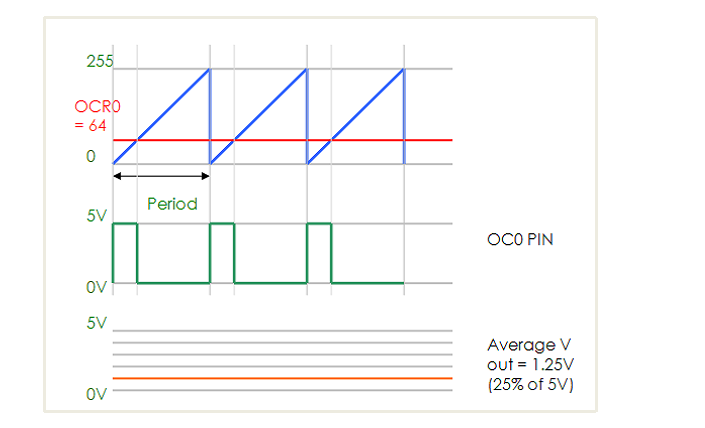

# 單晶片lab7結報
###### tags: `arduino`
###### 實驗日期 : 2021/11/18
## 上課教材
- [Timer](https://hackmd.io/@Alanzzzz/BkIn1jsDt)
- [ATmega328p的datasheet](http://ww1.microchip.com/downloads/en/DeviceDoc/Atmel-7810-Automotive-Microcontrollers-ATmega328P_Datasheet.pdf)
- [Arduino UNO原理圖](https://www.arduino.cc/en/uploads/Main/arduino-uno-schematic.pdf)

## lab1
### SPEC
不使用`delay()`，每2秒改變LED亮暗。<br>
使用Timer1 Register、Output Compare A Match Interrupt中斷模式、CTC mode。

### Timer內部暫存器原理
- 範例 : 透過計數器和除頻數，計算1秒
```cpp
DDRB = (1 << 5);  // set pin 13 OUTPUT
```
<br>
DDRB(The Port B Data Direction Register)從LSB數來第5位設為1，也就是OUTPUT。
<br>
ATmega328P的PB5設為OUTPUT，由上圖電路可知如果`PB5=HIGH`時，接在上面的diode順壓，因此會亮。

```cpp
TCCR1A = 0;             // TCCR1A Reset
```
<br>
register全都設為0，代表Timer Mode為Normal。

```cpp
TCCR1B = 0;             // TCCR1B Reset
TCCR1B |= (1 << CS12);  // 256 prescaler
```
<br>
CS12=1、CS11=0、CS10=0，代表除頻256。
$$\frac{16,000,000}{256} = 62,500$$

```cpp
TCNT1 = 3036;  // preload timer (65536-62500)
```
<br>
計數器從3036開始計數，一直數到65536，共62500個，因此每次數62500個時，由於CLK頻率是62,500Hz，因此即為1秒。

```cpp
TIMSK1 |= (1 << TOIE1);  // enable timer overflow interrupt
interrupts();  // enable interrupts
```
<br>
當TOIE這個bit為1，代表啟動overflow interrupt。

```cpp
ISR(TIMER1_OVF_vect) {  // interrupt
```
參考[AVR Interrupt Vectors](https://ece-classes.usc.edu/ee459/library/documents/avr_intr_vectors/)，`TIMER1_OVF_vect`定義為Timer/Counter1 Overflow。
```cpp
PORTB ^= (1 << 5);  // blink
```
|A|B|O|
|:-:|:-:|:-:|
|0|0|0|
|0|1|1|
|1|0|1|
|1|1|0|

在ISR裡面，假設一開始PORTB是1，與1做`XOR`會變為0，再與1做`XOR`又會變為0，如此0、1值不斷交替。
```cpp
TCNT1 = 3036;       // preload timer
}
```
在ISR裡面，要將計數器歸回3036重新開始數。

### 實現方法
```cpp
DDRB = (1 << 5);
```
根據datasheet P73與原理圖，設定PB5，也就是Ardunio Uno外部pin 13為OUTPUT。
```cpp
TCCR1B |= (1 << CS12) | (1 << CS10);
```
根據datasheet P110，`CS12=1`、`CS11=0`、`CS10=1`，代表除頻1024。
$$\frac{16,000,000}{1,024} = 15,625$$
```cpp
TCCR1B |= (1 << WGM12);
```
根據datasheet P109，`WGM12=1`、`WGM11=0`、`WGM10=0`代表Timer/Counter Mode是CTC。
```cpp
TIMSK1 |= (1 << OCIE1A);
```
根據datasheet P112，`OCIE1A=1`激活Timer/Counter1
output compare A match interrupt。
```cpp
TCNT1 = 0;
```
根據datasheet P113，TCNT1從0開始數。
```cpp
OCR1A = 31250;
```
根據datasheet P109，在CTC模式OCR1A為TOP，也就是說TCNT1會數到31250並歸0重數。因此在每秒數15,625下，數31,250次，就代表2秒。
$$\frac{31,250\text{ 次}}{15,625\text{ Hz}} = 2 \text{ s}$$
```cpp
ISR(TIMER1_COMPA_vect) {
    noInterrupts();
    PORTB ^= (1 << 5);  // blink
    interrupts();
}
```
在ISR裡面，使用`XOR`的特性使PB5在0、1之間切換。

## lab2
### SPEC
不使用`delay()`，顯示精度到毫秒的計時器在LCD螢幕上。

### 實現方法
同[lab1](#lab1)原理，為了要使精度能到毫秒
```cpp
TCCR1B |= (1 << CS12) | (1 << CS10);
```
除頻1024。
$$\frac{16,000,000}{1,024} = 15,625$$
```cpp
OCR1A = 15.625;
```
CTC mode的上限設為15.625。
$$\frac{15.625\text{ 次}}{15,625\text{ Hz}} = 0.001 \text{ s} = 1 \text{ ms}$$
可得至1毫秒精度。

## lab3
### SPEC
不使用`delay()`，使用超聲波模組，每秒測量一次距離，並顯示在多工七段顯示器上。

### 實現方法
同[lab1](#lab1)原理，每秒的間距即為除頻256、上限62500。
```cpp
TCCR1B |= (1 << CS12);
OCR1A = 62500;
```
$$\frac{62500\text{ 次}}{\frac{16,000,000}{256}\text{ Hz}} = 1 \text{ s}$$

## lab4
### SPEC
不使用`analogRead()`，讀取可變電阻之類比值，並在Serial port顯示出來。<br>
使用ADMUX、ADCSRA及ADCH/L Register。

### 實現方法
在`setup()`裡面先設定好以下參數
```cpp
ADMUX |= (1 << REFS0);
```
根據datasheet P217，`REFS1=0`、`REFS0=1`代表參考電壓設定為AV~CC~ with external capacitor at AREF pin。
```cpp
ADCSRA |= (1 << ADEN);
```
<br>
根據datasheet P218，`ADEN=1`代表啟動ADC。

```cpp
ADCSRA |= (1 << ADPS2) | (1 << ADPS1) | (1 << ADPS0);
```
根據datasheet P218，`ADPS2=1`、`ADPS1=1`、`ADPS0`代表除頻128。

---
在`loop()`內反覆執行以下副函式。
```cpp
uint16_t ReadADC(uint8_t channel) {
    // modulo to lower 3 bits, so between 0-7
    // use a bit mask to keep the original lower 3 bits
    channel = channel & 0b00000111;
    ADMUX |= channel;

    // start conversion
    ADCSRA |= (1 << ADSC);
    // wait until conversion is finished
    while(ADCSRA & (1<<ADSC))
        return ADC;  //return data
}
```
根據datasheet P209，首先要了解First Conversion (Single Conversion Mode)。


根據datasheet P218，Analog Channel Selection Bits的選擇表為
|MUX3..0|Single Ended Input|
|:-:|:-:|
|0000|ADC0|
|0001|ADC1|
|0010|ADC2|
|0011|ADC3|
|0100|ADC4|
|0101|ADC5|
|0110|ADC6|
|0111|ADC7|

因此只有channel後3位才是有效值，如果要設定ADC1為類比輸入channel就要設為`0b00000001`，也可以使用`ADMUX |= (1 << MUX0);`。
```cpp
ADCSRA |= (1 << ADSC);
```
根據datasheet P218，`ADSC=1`開啟ADC Conversion。
```cpp
while (bit_is_set(ADCSRA, ADSC))
// or while(ADCSRA & (1<<ADSC))
    return ADC;
```
當ADSC回到1代表結束ADC Conversion，根據datasheet P206的block diagram，最後回傳ADC(ADC Multiplexer Output)。

- ref 1 : [mrsunny0/learning-playground](https://github.com/mrsunny0/learning-playground/wiki/AVR#adc)
- ref 2 : [bit_is_set()](https://garretlab.web.fc2.com/en/arduino/inside/hardware/tools/avr/avr/include/avr/sfr_defs.h/bit_is_set.html)

## lab5
### SPEC
不使用`analogRead()`, `analogWrite()`。<br>
藉由Timer1 Register中PWM模式，使用可變電阻調整LED之亮暗。

### 實現方法
`analogRead()`功能同[lab4實現方法](https://hackmd.io/@arduino/report-7#實現方法3)，而`analogRead()
```cpp
TCCR1A |= (1 << WGM11);
TCCR1B |= (1 << WGM12);
TCCR1B |= (1 << WGM13);
ICR1 = TOP;
```
根據datasheet P109，設定為mode 14(Fast PWM)，TOP值為ICR1。
```cpp
TCCR1A |= (1 << COM1B1);
```
根據datasheet P109，`COM1B0=0`、`COM1B1=1`代表Clear OC1A/OC1B on compare match (set output to low level)。
```cpp
OCR1B = constrain(ReadADC(1), 0, TOP);
```
在loop裡面限制ReadADC(1)只能在0與TOP值變化，如下圖只能在計數器這段區間變化，當OCR1B變大時，PWM在高電位的訊號變大，因此Duty Cycle變大，反之亦同。如此動態調節OCR1B的值去實現寫入PWM的動作`analogWrite()`。


- ref : [Microcontrollers: What is the difference between "normal" PWM and fast PWM?](https://www.quora.com/Microcontrollers-What-is-the-difference-between-normal-PWM-and-fast-PWM)

## lab6
### SPEC
使用`timer.h`，實作[lab3](#lab3)功能。

### 實現方法
`Timer.h`函式庫解決使用`delay()`時，程式會停擺在那邊，無法再處裡其他動作，因此可以控制數個LED以不同頻率閃爍。
以下為函式庫內常用的指令
```cpp
#include "Timer.h"  //引用Timer程式庫
Timer T; //建立計時器物件(T可以自訂名稱)
t.oscillate(腳位, 時間, 狀態); //設定多少毫秒切換一次狀態(HIGH or LOW)
t.every(時間, 函式); //設定固定時間，呼叫函示
t.update(); //在loop裡面會檢查更新計時器
```
因此我只需將[lab3](#lab3)
- setups內加上
```cpp
t.every(1000, supersonic);
```
每隔1秒呼叫函式`supersonic()`。
- loop內加上
```cpp
t.update();
```
不斷更新檢查。

- ref : [Arduino: Timer(計時器) 使用教學，比delay好用的計時方式。](https://crazymaker.com.tw/arduino-how-to-use-timer/)

## 課後習題
### Question 1
Arduino上的ATmega328p所採用的是AVR架構；之後課程用到的STM32則是使用ARM架構，比較兩種架構的差別。

### Answer 1
- 微控制器不同的主流架構差別。

| X    | 8051 | PIC  | AVR  | ARM  |
| ---- | ---- | ---- | ---- | ---- |
| 總線寬度|標準內核為8位|8位/16位/32位|32分之8位|32位大多數也可用於64位|
|通信協議|UART, USART, SPI, I2C|PIC, UART, USART, LIN, CAN, 乙太網, SPI, 12C|UART, USART, LIN, 12C, 乙太網, SPI, I2C(專用AVR支持CAN,USB, 以太網)|UART, USART, LIN, 12C,  SPI, CAN, USB, 乙太網, I2C, DSP, SAI(串列音頻介面), IrDA|
|速度|12時鐘/指令周期|4時鐘/指令周期|1個時鐘/指令周期|1個時鐘/指令周期|
|記憶|ROM, SRAM, FLASH|SRAM, FLASH|閃存, SRAM, EEPROM|閃存, SDRAM, EEPROM|
|ISA|CLSC|RISC的一些功能|RISC|RISC|
|內存架構|馮諾依曼建築|哈佛建築|改性|改進的哈佛架構|
|能量消耗|平均|低|低|低|
|家庭|8051個變種|ARMv4.5.6.7和系列|PIC16, PIC17, PIC18, PIC24, PIC32|Tiny, Atmega, Xmega, 專用AVR|
|社區|廣大|很好|很好|廣大|
|生產廠家|Philips, Atmel, Slicon Labs ,Intel等|Microchip|Atmel|Apple, Nvidia, Qualcomm, Samsung等|
|成本與功能相比|非常低|平均|平均|低|
|其他功能|以其標準而聞名|廉價|便宜、高效|高速運轉|
|流行的微控制器|AT89C51. Psy51等|PIC18FXX8, PIC16F88X, PIC32MXX|Atmega8,16,32, Arduino社區|Cortex-R系列(實時任務處理，主要應用領域包括汽車、相機、工業、醫學)、Cortex-M系列(最節能的嵌入式設備)、Cortex-A系列(以最佳功耗實現最高性能)|

- AVR架構與ARM架構差別

| No.  | AVR                                                          | ARM                                                          |
| :--: | :----------------------------------------------------------- | :----------------------------------------------------------- |
| 01.  | AVR micro controller refers to Advanced Virtual RISC (AVR).  | ARM micro controller refers to Advanced RISC Micro-controller (ARM). |
| 02.  | It has bus width of 8 bit or 32 bit.                         | It has bus width of 32 bit and also available in 64 bit.     |
| 03.  | It uses ART, USART, SPI, I2C communication protocol.         | It uses SPI, CAN, Ethernet, I2S, DSP, SAI, UART, USART communication protocol. |
| 04.  | Its speed is 1 clock per instruction cycle.                  | Its speed is also 1 clock per instruction cycle.             |
| 05.  | Its manufacturer is Atmel company.                           | Its manufacturer is Apple, Nvidia, Qualcomm, Samsung Electronics and TI etc. |
| 06.  | It uses Flash, SRAM, EEPROM memory.                          | It uses Flash, SDRAM, EEPROM memory.                         |
| 07.  | Its family includes Tiny, Atmega, Xmega, special purpose AVR. | Its family includes ARMv4, 5, 6, 7 and series.               |
| 08.  | It is cheap and effective.                                   | It provides high speed operation.                            |
| 09.  | Popular micro-controllers include Atmega8, 16, 32, Arduino Community. | Popular micro-controllers include LPC2148, ARM Cortex-M0 to ARM Cortex-M7, etc. |

ARM是IP核，可供各大晶元商集成到各自的設計中，好比是軟體語言中的C++，如果你想換一家廠商或者某家的貨太貴，都會有其它的廠商來競爭，至少從理論上，你不會被一家廠商套住。AVR這方面就差點，ATMEL一家，別無分號。你只能在他的系列中選一個型號，無法選廠家。好比是軟體語言中的Java，雖然現在免費（指Java的SDK，不是AVR）或價格低，但市場前景更多的掌握在廠商手中。

實際產品成本方面，AVR優於ARM，畢竟AVR是8位機，配什麼外設都便宜，由於速度比ARM低，PCB版也好設計，20MHz的數字電路基本上只要通就行了，不用過多考慮信號完整性什麼的。而ARM的速度能輕易上100MIPS，32位的CPU也不是吹的，速度上AVR根本沒法比，不過帶來的問題就多了，要4層PCB，而且外設也貴多了。

功能方面，ARM大大優於AVR，ARM可以做手機，AVR顯然不行，但最大的優勢在ARM上可以跑Linux，Linux可以做很多事，在功能上的優勢意味著ARM比AVR有著更廣的應用範圍。

- ref 1 : [Difference between AVR and ARM](https://www.geeksforgeeks.org/difference-between-avr-and-arm/)
- ref 2 : [比较AVR和ARM，谈谈相同与区别](http://news.eeworld.com.cn/mcu/article_2016071827633.html#:~:text=AVR%E5%92%8CARM%E7%9A%84%E5%8C%BA%E5%88%AB,%E4%B8%80%E4%B8%AA%E5%9E%8B%E5%8F%B7%EF%BC%8C%E6%97%A0%E6%B3%95%E9%80%89%E5%8E%82%E5%AE%B6%E3%80%82)
- ref 3 : [8051，PIC，AVR和ARM有什么区别？](https://zhuanlan.zhihu.com/p/51222150)
- ref 4 : [ARM架构版本及处理器系列详细介绍](https://blog.csdn.net/qq_34160841/article/details/105611131) 

### Question 2
分別描述在ATmega328p晶片上的PWM模式：Normal Mode, CTC Mode, Fast PWM Mode,及 Phase Correct PWM Mode。(Hint : 參考[datasheet P79](http://ww1.microchip.com/downloads/en/DeviceDoc/Atmel-7810-Automotive-Microcontrollers-ATmega328P_Datasheet.pdf))

### Answer 2
參照[lab6 Question 2](https://hackmd.io/@arduino/report-6#Answer-2)。

|模式|TCNT計數器|
|:-:|:-:|
|Normal|從0數到overflow，並進入ISR裡面處理 - 歸0重數。|
|CTC||
|Fast PWM||
|Phase-correct PWM||

## 心得
### 劉永勝
這次實驗並不是直接呼叫arduino的函式或巨集，而是直接更改ATmega328p的register，藉由更改register所存取的位元，執行晶片的功能。相較於現成函式，這樣更改register的方式相當麻煩，須先設定enable、mode等，才能寫入值。但也因為直接改寫暫存器的值，能更了解此晶片的功能。但這不是3hr就能理解的。

### 李宇洋
此次實驗要直接使用Arduino上的ATmega328p做操作，因為實驗的內容主要是對硬體原本所配置的暫存器在IDE上直接操作，觸發中斷程序以作為Timer使用，所以需要直接查詢晶片在datasheet上製作時的設定。有一部分Code雖然助教都已經幫忙打好了，但是要在4、5個小時內理解各個暫存器還有裡面的各個bits負責的功能真的有點困難。

### 陳旭祺
前面幾周都是調用別人寫好的函式庫，去實現我們需要的功能，但這次lab開始深入探討並直接操作硬體的register，這部分需要具備看datasheet與分析電路圖的能力。前者偏向Arduino社群的業餘玩家，只需要使用別人寫好的函式庫，不需要搞懂硬體底層，就能快速實作出想要的功能，很有成就感；後者偏向嵌入式開發所探討的硬體底層，我們光是實現一個`delay()`功能就研究不少時間，較沒有成就感。

lab1-lab3為實現`delay()`功能，使用Timer的CTC mode、lab4-lab5實現`analogRead()`,`analogWrite()`，讀入類比值使用Single Conversion Mode，而寫出類比值，藉由動態改變Fast PWM下`OCR1B`的值，去影響PWM的duty cycle。