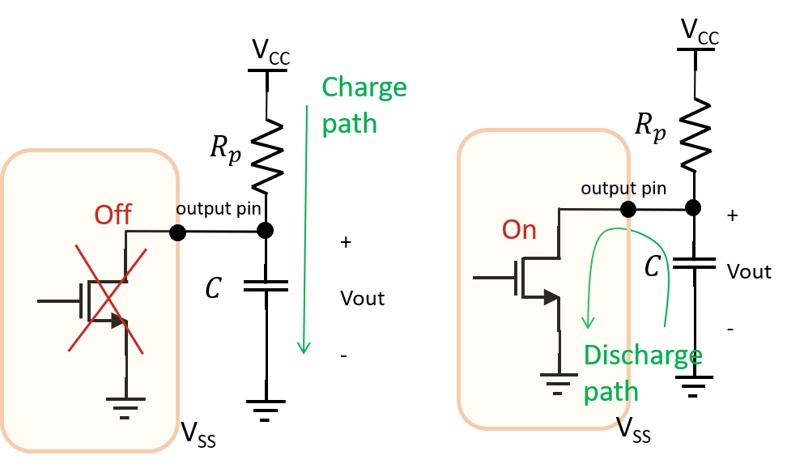
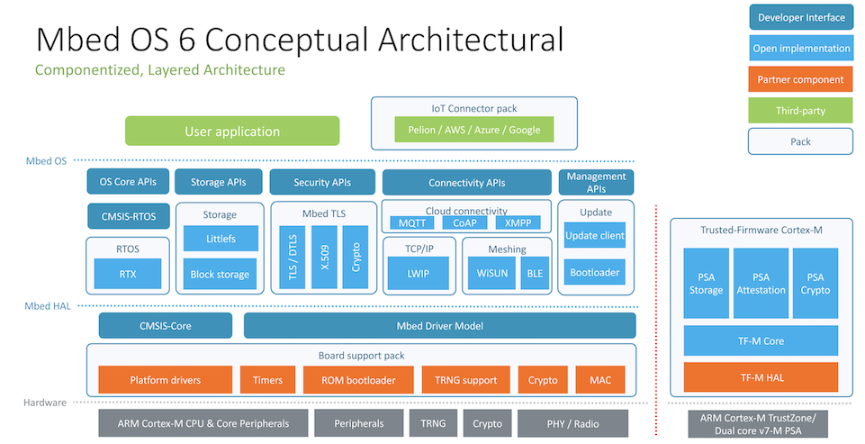
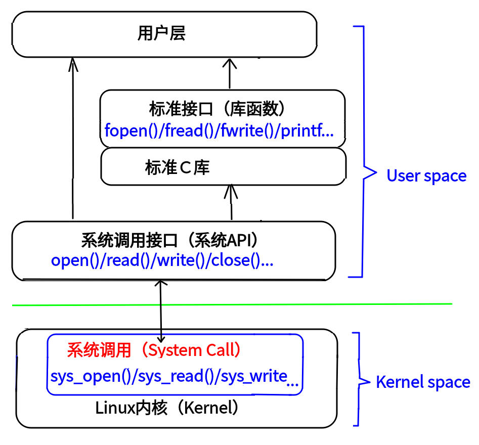

# 單晶片lab8結報
###### tags: `stm32`
###### 實驗日期 : 2021/12/02
## 上課教材
- [STM32 Mbed開發環境](https://hackmd.io/4gBUsL4fTYyEsA5RxFq2Dg)
- [I/O、interupt](https://hackmd.io/@G8HrHAUqQyCt9mHFYW05UA/SkBGaA2OF)

## Mbed
- [Full API list](https://os.mbed.com/docs/mbed-os/v6.15/apis/index.html)
- [Pinout](https://hackmd.io/uJrNrB3rTgKHdyLhTJY74Q)
- 實驗流程
    1. 使用本地端文字編輯器(VSCode)編寫。
    2. 選好板子型號並由[線上comiler](https://os.mbed.com/)生成二進位`*.bin`檔案。
    3. 丟進板子的硬碟，會自動燒錄。
    4. 開啟Serial的監控螢幕(MobaXterm)，進行debug。

### [DigitalOut](https://os.mbed.com/docs/mbed-os/v6.15/apis/digitalout.html)
```cpp
DigitalOut (PinName pin)
```
有參構造函數，指定腳位，創建`DigitalOut`這個類的對象。

```cpp
DigitalOut(PinName pin, int value)	
```
同上，創建對象，並賦予指定腳位初始值。

```cpp
DigitalOut::int is_connected()
```
非0值代表連接，0值代表未連接(NC, not connected)。

```cpp
DigitalOut::DigitalOut& operator= (int value)
DigitalOut::DigitalOut& operator= (DigitalOut &rhs)
```
運算符重載(operator overloading)，重載符號`=`，等同於`write()`或是將等號的右邊同一對象調用拷貝構造函數，拷貝至等號左邊。

```cpp
DigitalOut::int read()
DigitalOut::void write(int value)	
```
**回傳輸出設定**或設定輸出，值為`0`或`1`。

```cpp
DigitalOut::operator int() {
    // Underlying call is thread safe
    return read();
}
```
`operator type_name`為**指定隱式轉換的規則(implicit conversion operator)**，當該物件要隱式轉換為整數型態時，會呼叫這個函數。
- ref 1 : [What does operator float*() do?](https://stackoverflow.com/questions/24261286/what-does-operator-float-do)
- ref 2 : [How do conversion operators work in C++?](https://stackoverflow.com/questions/1307876/how-do-conversion-operators-work-in-c)
- ref 3 : [user-defined conversion function](https://en.cppreference.com/w/cpp/language/cast_operator)

### [DigitalIn](https://os.mbed.com/docs/mbed-os/v6.15/apis/digitalin.html)
```cpp
DigitalIn(PinName pin)
```
有參構造函數，指定腳位，創建`DigitalIn`這個類的對象。
```cpp
DigitalIn(PinName pin, PinMode mode)	
```
同上，創建對象，並設定這個腳位的初始模式。
```cpp
DigitalIn::int is_connected()
```
非0值代表連接，0值代表未連接(NC)。
```cpp
DigitalIn::void mode(PinMode pull)
```
設定輸入腳位的模式。
|PullUp|PullDown|PullNone|OpenDrain|
|:-:|:-:|:-:|:-:|
|上拉電阻(電阻在上面，按下時狀態是0)|下拉電阻(電阻在下面，按下時狀態是1)|無額外電路|輸出腳位是MOSFET的drain端，需與PullUp搭配使用|
|||X||

- ref : [Termination of Open Drain Output Pins](https://microchipsupport.force.com/s/article/Termination-of-Open-Drain-Output-Pins)

```cpp
DigitalIn::operator int() {
    // Underlying call is thread safe
    return read();
}
```
指定當物件要轉換為`int()`資料型態的隱式轉換規則。
```cpp
DigitalIn::int read()	
```
讀取輸入值。
### 範例
```cpp
DigitalIn button(BUTTON1);
DigitalOut led(LED1);
led = button;   // Equivalent to led.write(button.read())
```
平常物件是不能做賦值操作的，但是在這個`DigitalOut`的類裡面運算符等於`=`進行運算符重載(operator overloading)，因此`led = button`等價於`led.write(button)`，這個成員函數`led.write(int value)`是傳入整數型態的參數的，因此
```cpp
int value = button
```
要將`button`對象這個`DigitalIn`的隱式轉換((implicit conversion)為`int`的資料型態，正常情況下程式是會出錯的，但因為在這個`DigitalIn`的類中，我們已經定義隱式轉換的規則，因此會呼叫`DigitalIn::operator int()`這個成員函式，如上函式所規定會回傳`read()`，因此最後函數會等於`led.write(button.read())`。


### [RawSerial](https://os.mbed.com/docs/mbed-os/v5.15/apis/rawserial.html)
繼承`Serial class`屬性，不使用stream，因此可以安全使用RTOS的interrupt handlers，使用`UART`傳輸協定。
- 比較 : [`printf()`](https://os.mbed.com/docs/mbed-os/v6.15/debug-test/debugging-using-printf-statements.html)是將開發板資訊傳輸給電腦，但非常消耗效能，如果再加上轉換格式(formatting)，效能還會更吃重。
```cpp
RawSerial(PinName tx, PinName rx, int baud = MBED_CONF_PLATFORM_DEFAULT_SERIAL_BAUD_RATE)
```
設定傳輸`TX`與接收`RX`腳位，鮑率設定是默認參數，可指定或是不指定(optional)，默認是後面那串巨集(macro)。
```cpp
RawSerial::int getc()
```
從serial port讀取字元。
```cpp
RawSerial::int putc(int c)
RawSerial::int puts(const char* str)
RawSerial::int getc()
```
寫char/C-string到serial port，或從serial port讀值。
```cpp
RawSerial::int readable()
RawSerial::int writeable()
```
回傳1代表可讀/寫，否則回傳0。
```cpp
RawSerial::int printf(const char *format, ...)
```
印出C-string。

### [Timer](https://os.mbed.com/docs/mbed-os/v5.15/apis/timer.html)
|成員函數|功能|
|:-|:-:|
|`void start()`|開始計時|
|`void stop()`|停止計時|
|`void reset()`|歸零|
|`float read()`|回傳浮點型態的秒數|
|`int read_ms()`|回傳整數型態的毫秒數|
|`operator float()`|指定轉換為`float`資料型態的隱式轉換規則，等價於`read()`|

### [InterruptIn](https://os.mbed.com/docs/mbed-os/v5.15/apis/interruptin.html)
```cpp
InterruptIn(PinName pin)
```
有參構造函數，指定腳位，創建`DigitalIn`這個類的對象。
```cpp
InterruptIn(PinName pin, PinMode mode)	
```
同上，創建對象，並設定這個腳位的模式，有`PullNone`, `PullDown`, `PullUp`,`PullDefault`，請看`PinNames.h`檔案。
```cpp
InterruptIn::void disable_irq()
InterruptIn::void enable_irq_irq()
```
開啟/關閉IRQ。
>周邊設備會向電腦發出中斷要求(IRQ, interrupt request)。
```cpp
InterruptIn::void fall(Callback< void()> func)
InterruptIn::void fall(T* obj, M method)
InterruptIn::void rise(Callback< void()> func)
InterruptIn::void rise(T* obj, M method)
```
當數位訊號1到0(`fall`)或是0到1(`rise`)時，會進入ISR，也就是該成員函數後面我們自定義的處理函數。

第1種寫法第1個參數是`func`為指定處理函數的地址。
第2種寫法第1個參數是物件的地址，第2個參數是物件成員函數的地址。
```cpp
void mode(PinMode pull)	
operator int()
int read()	
```
功能與`DigitalIn`的成員函數相似，可相互對照。

> 在ISR裡面要避免使用blocking或是bulky library functions，像是wait, infinite while loop, blocking calls, printf, malloc, new等。

### [Ticker](https://os.mbed.com/docs/mbed-os/v5.15/apis/ticker.html)
每經過一段時間就引發中斷。
```cpp
Ticker::void attach (F &&func, float t)
```
`func`為指定函數的地址、`t`為呼叫該函式間隔的秒數。

### [Timeout](https://os.mbed.com/docs/mbed-os/v5.15/apis/timeout.html)
等待一段時間再呼叫函數 (經過測試只會執行一次)。
> A Timeout is used to call a function at a point in the future.
```cpp
Timeout::void attach (F &&func, float t)
```
`func`為指定函數的地址、`t`為呼叫該函式間隔的秒數。

### [AnalogOut](https://os.mbed.com/docs/mbed-os/v6.15/apis/analogout.html)
類比輸出。Mbed OS支持$\frac{V_{CC}}{65,536V}$的精度，但實際精度還是取決於硬體。
```cpp
AnalogOut(PinName pin)
```
有參構造函數，指定腳位，創建`AnalogOut`這個類的對象。
```cpp
AnalogOut::operator float() {
    // Underlying call is thread safe
    return read();
}
AnalogOut::AnalogOut& operator=(float percent) //write
AnalogOut::AnalogOut& operator=(AnalogOut& rhs) //write
```
功能與前面成員函數類似，有種物件導向中**多態**的感覺(一般在父類聲明關鍵字`virtual`做虛實現，並在同一繼承下的不同子類個別實例化該成員函數)，但實際上由他的源碼看，這不是多態，`AnalogOut`並未繼承任何類。
```cpp
AnalogOut::float read()
AnalogOut::void write(float value)
AnalogOut::void write_u16(unsigned short value)
```
前面兩2個成員函數value介在$[0.0f, 1.0f]$，代表$0V/0\%$到$3.3V/100\%$，最後1個成員函數value介在$[0, 65536(\rm{0xFFFF})]$之間。

---

## lab1
### SPEC
以LED1~3實現單向跑馬燈。

### 實現方法
```cpp
DigitalOut *LED_X[3];
```
創建`DigitalOut`類型的指標陣列。陣列可以存放相同類型的資料，本身也是指標，因此可以說是**指標的指標**(二級指標)。
```cpp
LED_X[0] = new DigitalOut(LED1);
LED_X[1] = new DigitalOut(LED2);
LED_X[2] = new DigitalOut(LED3);
```
使用關鍵字`new`，在heap區配置`DigitalOut`這個類所需要的空間，並傳回該空間的位址，這邊使用在stack區的指標陣列來儲存位址。經實際程式模擬，如上，在有參構造函數`DigitalOut(PinName pin, int value)`未指定第2個參數時，腳位的初始值為0。
```cpp
int i = 0;
// Blink LED
while (1) {
    (*LED_X[i%3]) = !(*LED_X[i%3]);
    wait(1);
    (*LED_X[i%3]) = !(*LED_X[i%3]);
    i++;
}
```
`i`從0開始依序加一，當`i = 3`時`i%3 = 0`回到0，因此$i \;\rm{mod}\; 3 \in [0, 1, 2]$，`i`會在0到2之間不斷循環。

而在對相應指標陣列內的指標進行解引用(dereference)得出指向的該值，如同前面所述的[Mbed範例](#範例)觀念，假設解引用物件為`DigitalOut object_X`簡化問題，程式改寫為
```cpp
object_X = !object_X
```
一般情況下是無法對物件直接做`NOT`運算，去看這個類的`*.h`函數聲明檔。
```cpp
DigitalOut::operator int() {
    // Underlying call is thread safe
    return read();
}
```
有指定隱式轉換的規則(user-defined conversion function)，因此`DigitalOut object_X`會先做隱式轉換，去呼叫上述副函式，一開始腳位初始數值是0，做`NOT`得1。

因此程式會等價於`object X = 1`，一樣的，一般情況下是無法對物件直接做賦值`=`操作，去看這個類的`*.h`函數聲明檔。
```cpp
 DigitalOut& operator= (int value) {
    // Underlying write is thread safe
    write(value);
    return *this;
}
```
有運算符重載(operator overloading)，重載符號`=`，運算符重載本質上還是成員函數，因此`object_X = 1`等價於
```cpp
object_X.operator=(1)
```
`object_X`這個對象會呼叫自己的成員函數，並傳入參數`1`，一開始會`object_X.write(1)`，修改自己輸出的設定，接下來由於`this`指針是指向當下的物件，做解引用`*this`即為自己的物件本體，需要由引用(pass by reference)的方式`DigitalOut&`回傳本體。

否則將會以值(pass by value)的方式返回物件，會調用到拷貝構造函數，創建出新的對象`object_Y`，這會造成一個很大的問題，因為返回的物件並非原來的物件。

總結來說以下程式是等價的
```cpp
object_X = !object_X
// user-defined conversion function
object_X = !(int object_X.read()) 
// operator overloading
object_X.operator=( !(int object_X.read()) )
// in user-dinfined member function
object_X.write( !(int object_X.read()) )
```
- ref : [Why is the data type needed in pointer declarations?](https://stackoverflow.com/questions/9802585/why-is-the-data-type-needed-in-pointer-declarations)

## lab2
### SPEC
承[lab1](#lab1)，在`USER_BUTTON`被按下時停止，放開時LED跑馬燈會往反方向。

### 實現方法
```cpp
DigitalIn button(USER_BUTTON); // the button on your board
if (button.is_connected())
    printf("button is connected and initialized! \n\r");
button.mode(PullNone); // floating
```
創建`DigitalIn`類的按鈕對象，檢查有無連接，並設定為浮接，即無額外電路。
```cpp
// LED ON // do something
// button being pressed
if (button.read()) {
    clockwise = !clockwise;
    while (1) {
        if (!button.read()) // button being released
            break;
    }
}
// LED OFF // do something
//順或逆時針LED跑馬燈 
if (clockwise) i++;
else i--;
```
在LED開啟與關閉之間插入以上判斷式，切換布林運算，更改LED跑馬燈的順逆時鐘順序，接下來持續點亮跑到當下的LED燈，直到按鈕被放開。

## lab3-1
### SPEC
在serial monitor上輸入指令控制LED。
|指令|功能|
|:-:|:-:|
|G|切換LED1狀態|
|B|切換LED2狀態|
|R|切換LED3狀態|
|1|切換所有LED狀態|
|其他|顯示錯誤訊息|

### 實現方法
盡量避免使用`printf`，而使用`RawSerial`這個類，做PC與板子的通訊連接，讀取字元，echo到serial monitor，並做相應LED的反應。需要注意換行的規則是使用Window系統`\r\n`(CR (Carriage Return), LF(Line Feed))，詳細內容請見[lab3 lab3-2 實現方法](https://hackmd.io/@arduino/report-3#實現方法5)。


## lab3-2
### SPEC
一開始跑馬燈順序`GBRA`，`USER_BUTTON`長按進入在serial monitor上輸入指令狀態，接著透過輸入`R`,`G`,`B`,`A`(外接的LED)的不同排列順序改變起始亮燈順序，須有輸入的錯誤偵測，並在按下Enter後回到跑馬燈順序`GBRA`。

### 實現方法
設定一個整數陣列`int order[4]`在serial monitor上輸入`GBRA`對應`0123`，輸出其他字元則要求重新輸入。
```cpp
//get order from array value
int led_order = order[counter % 4];
//blinking of LED
*X[led_order] = !*X[led_order];
wait(0.5);
*X[led_order] = !*X[led_order];
wait(0.5);
//0,1,2,3 increasing
counter++;
```
接下來讓`int order[4]`不斷從0到3讀值，讓個別LED亮燈。
```cpp
if (pc.readable()) {
    cmd = pc.getc();
    if (cmd == '\r') {
        pc.printf("Back to initial setting\r\n");
        while (pc.readable()) pc.getc();//clean buffer
        break;
    }
}
```
當serial monitor有值時，且為Enter鍵(控制字元`\r`, Carriage Return, 回車)，則跳脫迴圈(保險起見，清空buffer避免非預期的錯誤)。

## lab4
### SPEC
使用Timer，消除`USER_BUTTON`的去彈跳現象，然後記錄BUTTON被按下的次數，在`USER_BUTTON`被按下時輸出次數到serial monitor。(當按鈕被按著不放時，只算一次)

### 實現方法
```cpp
if (button.read() && (t_ms > 400)) {
    while (1) {
        // release button
        if (!button.read()) {
            count++;
            printf("%d\n\r", count);
            timer.reset();  // counting from 0
            break;
        }
    }
}
```
按鈕放開時，timer開始計數，等到下次按鈕再被按下，且間隔秒數大於0.4秒則再次進入迴圈，0.4秒的緩衝是作為de-bouncing的緩衝，在這段時間所有讀到任何值都是無效的。

## lab5-1
### SPEC
一開始LED1閃爍，使用Timeout 5秒後轉為閃爍LED2。

### 實現方法
在C++裡面有三種創建物件的方法
1. 括號法
```cpp
person p;      //默認構造函數
person p2(50); //有參構造函數
person p3(p2); //拷貝構造函數
```
2. 顯示法
```cpp
person p1;
person p2 = person(10);  
// person(10)是匿名對象 當前行執行結束後，系統會立即回收掉匿名對象
person p3 = person(p2);
```
3. 隱式轉換法
```cpp
person p4 = 10;  // Person p4 = Person(10); 
person p5 = p4;  // Person p5 = Person(p4); 
```
- 我們的程式
```cpp
DigitalOut object_X = LED2;
```
這邊`LED2`是巨集(macro)，會在編譯階段的前置處理器預處理(preprocessing)替換成相應的定義，也就是**巨集展開(macro expansion)**，經過實測推測對應巨集應該為
```cpp
#define LED1 16
#define LED2 23
#define LED3 30
```
因此`DigitalOut object_X = LED2`經過編譯器預處理結果是
```cpp
DigitalOut object_X = 23;
```
如上這是一個隱式轉換法去創建對象，實際上編譯器應該解釋為
```cpp
DigitalOut object_X = DigitalOut(23);
```
首先創建一個匿名對象，由於匿名對象的生命周期為整個函數周期，當前行結束之後，馬上調用析構函數，因此匿名對象需要一個對象去接。

以下範例
```cpp
DigitalOut object_X = 23;
object_X = 1;
```
需要辨別的是隱式轉換法與函數重載，兩者雖然很像，但是經過轉換是截然不同的東西，因此實際上程式解讀為
```cpp
DigitalOut object_X = DigitalOut(23); //create obeject
object_X.write(1); //turn on LED
```
上述程式就是創建一對象，並寫入1值，讓LED亮。
- ref : [How to initialize Array of objects with parameterized constructors in C++](https://www.geeksforgeeks.org/how-to-initialize-array-of-objects-with-parameterized-constructors-in-c/)

---

根據上述觀念加上使用array，因此最終我們的程式可以簡化為
```cpp
DigitalOut led[2] = {LED1, LED3};
```
```cpp
//ISR
void flip() {
    turn_on_2 = true;
    led[0].write(0);
}
flipper.attach(&flip, 5.0);
```
接下來等待5秒進入自定義的ISR，切換布林函數值，並做相對應LED的反應。

## lab5-2
### SPEC
實現呼吸燈。亮暗週期為亮至暗2秒、暗至亮2秒。

### 實現方法
```cpp
t_ms = timer.read_ms();
led1.write_u16(sample);  //analog write
//前2秒漸亮；後2秒漸暗
sample = (t_ms % 4000 < 2000) ?  NORMAL * (t_ms % 2000) : NORMAL * (2 - (t_ms % 2000));
```
`#define NORMAL (65536 / 2000)`就是0到2000與0到65536的mapping，創建計時物件，前2秒類比寫入漸亮值；後2秒類比寫入漸暗值。

## lab6
### SPEC
實現碼錶。使用七段顯示器顯示秒數，秒數精準到小數2位，秒數為個位數時，不顯示十位數數字。

|按鈕|功能|
|:-:|:-:|
|短按|停止/開始|
|長按|歸零並停止|

### 實現方法
難點在於秒數為個位數時，不顯示十位數數字。
```cpp
SEG_COM[0] = new DigitalOut(D10);
// ... (omit)
SEG_COM[2] = new DigitalOut(D12);
digit[0] = new DigitalOut(D2);
// ... (omit)
digit[7] = new DigitalOut(D9);  // dp
```
如同前面的lab實作方式，一樣是在heap區申請空間，創建接口對象，但一開始不創建顯示最高位(MSB)的對象，否則如果一開始新增對象，而不給值，會造成這個對象接口是未知的數字，而顯示亂碼。
```cpp
if (t_10ms > 999 && object_exist == false) {    
    SEG_COM[3] = new DigitalOut(D13);
    object_exist = true;
}
```
等到10秒以上時，才創建最高位(MSB)的對象，並用一個布林flag值去紀錄是否創建對象。
```cpp
if (object_exist == true) {
    delete SEG_COM[3];
    object_exist = false;
}
```
長按的功能是歸零並停止，當檢測到"已創建對象"會將這個對象釋放乾淨，並將flag設為false，代表該物件已被釋放。
```cpp
t_10ms = (timer.read_ms()) / 10;
if (t_10ms > 9999) {
    for (int i = 0; i < 3; i++) delete SEG_COM[i];
    for (int i = 0; i < 8; i++) delete digit[i];
    break;
}
```
最後秒數大於等於100秒時，會overflow，將所有從heap區創建的空間釋放，並結束程式。

## 課後習題
### Question 1
列出一表簡單表示STM32 NUCLEO-F207ZG與Arduino Uno的規格差異(例如：震盪器頻率、Pin腳數、Flash memory大小)。

### Answer 1
|item|STM32 NUCLEO-F207ZG|Arduino Uno|
|:-:|:-:|:-:|
|Microcontroller|ARM 32-bit Cortex-M3|ATmega328P|
|Flash memory|1 MB|32 KB|
|SRAM|128+4 KB|2 KB|
|oscillator|32 kHz|16 MHz|
|Operating Voltage|3.3 V, 5 V, 7 V to 12 V|5V|
|Security|POR, PDR, PVD, BOR|POR, BOR|
|Communication|UART, USART, I2C, I2S, SPI, CAN, SDIO|UART, I2C, SPI|
|ref|[NUCLEO-F207ZG](https://os.mbed.com/platforms/ST-Nucleo-F207ZG/)|[Arduino UNO R3](https://docs.arduino.cc/resources/datasheets/A000066-datasheet.pdf)|


### Question 2
簡述Mbed項目的創立目的與可能造成的影響。

### Answer 2
Mbed OS是一款開源作業系統，專為物聯網(IoT)設備設計的ARM微控制器的平臺，需要連接到互聯網的低功耗、受限設備。Mbed OS 為其運行的微控制器提供了一個抽象層，以便開發人員可以專注於編寫C/C++應用程式，這些應用程式調用一系列硬體上可用的功能。Mbed OS應用程式可在任何與Mbed相容的平臺上重複使用，增加程式的移植性。<br>


- ref : [MBED 介紹](https://jessekuo.wordpress.com/2019/07/25/mbed-%E4%BB%8B%E7%B4%B9/)

### Question 3
什麼是API?

### Answer 3
API（Application Programming Interface，應用程序接口）是一些**預先定義的接口**(如函數、HTTP接口)，或指軟體系統不同組成部分銜接的約定。用來提供應用程序與開發人員基於某軟體或硬體得以訪問的一組例程，而又**無需訪問源碼或理解內部工作機制**的細節。

常見的像是Linux API是linux提供的接口，某些API可能會將一個或多個系統調用(system call)封裝起來。<br>



- ref 1 : [API （应用程序编程接口）](https://baike.baidu.com/item/API/10154)
- ref 2 : [Linux的上的程序是如何运行的，api机制是怎么样？](https://www.zhihu.com/question/68079162#:~:text=Linux%20API%E6%98%AFlinux%E6%8F%90%E4%BE%9B,%E7%9A%84API%EF%BC%8Clinux%E5%9F%BA%E6%9C%AC%E5%85%BC%E5%AE%B9%E3%80%82)
- ref 3 : [系統呼叫、API之間的關係(圖)](https://www.itread01.com/content/1547793390.html)


## 心得
### 劉永勝
從本次實作以後，改用STM32實作，Arduino腳位直接指定`int`即可，但STM32需要使用物件來設定接腳，因為具有物件導向的觀念，讓每個腳位執行的功能較多，且控制方式較為彈性。

實驗中，在切換七段顯示器時遇到困難，因為太早生成COM腳位之物件，即使COM不給值，該七段顯示器位元也會亮。解決方式為晚點生成該腳位之物件。

### 李宇洋
此次實驗需要熟悉`STM32 NUCLEO-F207ZG`開發板，並且直接使用線上的IDE作compile，因此可以直接使用線上的library，省去了安裝多個函式庫的麻煩。主要使用Mbed進行開發，大多使用的語法為C++和C的混合，例如`printf`等。在研究button debounce的時候搞了很久，以前面Arduino實作累積的經驗應該不至於會搞太久，因此在按鈕如何實際運作方面我自己還需花時間研究。

### 陳旭祺
之前實驗是用`Arduino Uno R3`，這次實驗換了一塊`STM32 NUCLEO-F207ZG`的開發板，使用的`Mbed OS`目的與`Arduino`類似，就是方便開發者能在不同板子上使用同一份程式，而不需要每次換一塊板子，就要重寫程式、重新研究一次底層，具體來說`Mbed OS`把硬體底層做封裝，使開發者只需要專注於表層的程式。

`Mbed OS`的程式相比`Arduino`來說，讓我感到更濃厚的OOP(物件導向)的味道，連Pin腳都是一個物件，藉由看物件內部聲明檔`*.h`，我複習了C++的基本語法
- operator overloading (運算符重載)
- user-defined conversion function (使用者自定義轉換式)
- anonymous object (匿名對象)

與熟悉`Mbed OS`提供現成的函式庫
|函式庫|功能|
|:-:|:-:|
|`DigitalOut`, `DigitalIn`, `AnalogOut`, `AnalogIn`|數位類比輸入輸出|
|`RawSerial`|不使用stream，UART傳輸|
|`Timer`|計時器|
|`InteruptIn`, `Ticker`, `Timeout`|ISR (中斷程序)|