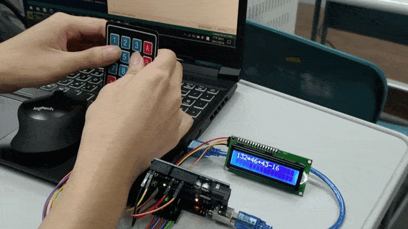
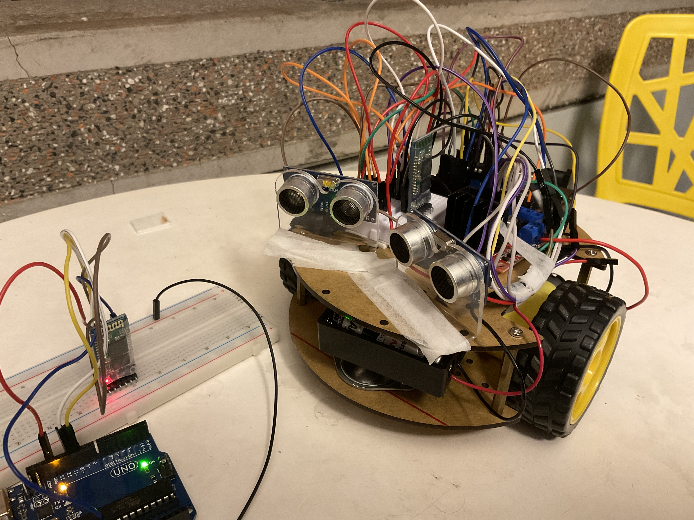

# Single Chip System
Time : 2021 fall (first half semester of junior)

## lecture

|subject|teacher|
|:-:|:-:|
|[單晶片系統](http://class-qry.acad.ncku.edu.tw/syllabus/online_display.php?syear=0110&sem=1&co_no=E230900&class_code=)|[戴政祺](https://www.ee.ncku.edu.tw/teacher/index2.php?teacher_id=125)|

- Arduino

|周次|日期|課程|
|:-:|:-:|:-:|
|W1|09/16|[110學年課程介紹](https://hackmd.io/@nsyRI3v6SuG6fKQFyi9Ugg/Hy_OTeRWK)|
|W2|09/23|[跑馬燈、按鍵、多工七段顯示器、鍵盤](https://hackmd.io/@Alanzzzz/SJDW5IumK)|
|W4|09/30|[密碼鎖、計步器](https://hackmd.io/@G8HrHAUqQyCt9mHFYW05UA/rJSzxDQ-K#Arduino%E8%AC%9B%E7%BE%A9%EF%BC%9A%E8%A8%88%E6%AD%A5%E5%99%A8)|
|W5|10/07|[SPI、藍芽模組](https://hackmd.io/@9ScCWm6PQhCqJjg8JfJKzQ/SJ2Ig1nVt)|
|W6|10/21|[超音波、步進馬達](https://hackmd.io/@us4sw9duT5aIGbNJpCM_-Q/r1cFVAulY)|
|W7|10/28|[自走車](https://hackmd.io/@nsyRI3v6SuG6fKQFyi9Ugg/H1c5B8dHF)|
|W10|11/18|[Timer](https://hackmd.io/@Alanzzzz/BkIn1jsDt)|

- STM32

|周次|日期|課程|
|:-:|:-:|:-:|
|W12|12/02|[I/O、interupt](https://hackmd.io/@G8HrHAUqQyCt9mHFYW05UA/SkBGaA2OF)|
|W13|12/09|[RTOS(上)](https://hackmd.io/@us4sw9duT5aIGbNJpCM_-Q/H16Iy48IY)|
|W14|12/16|[RTOS(下)](https://hackmd.io/@mzTjnf74ST6xKOB4FrGblQ/BJdEY4DqF)
|W16|12/30|[USBHost](https://hackmd.io/@9ScCWm6PQhCqJjg8JfJKzQ/SkYDpZqoY)|
<br>

## Report
> more info in the separate files
- [lab01](#lab01)
- [lab02](#lab02)
- [lab03](#lab03)
- [lab04](#lab04)
- [lab05](#lab05)
- [lab06](#lab06)
- [lab07](#lab07)
- [lab08](#lab08)
- [lab09](#lab09)
- [lab10](#lab10)

<br>

## Environment
1. OS
- `Windows 10 21H1`
2. IDE
- [`Arduino IDE 1.8.16`](https://www.arduino.cc/en/software) (lab1-lab7)
- [Mbed Online comiler](https://os.mbed.com/) (lab8-lab11)

3. Text Editor
- `VScode 1.60.2` with plug-in  [`Arduino`](https://marketplace.visualstudio.com/items?itemName=vsciot-vscode.vscode-arduino)

4. Serial Monitor
- `MobaXterm Home Edition 21.5` (lab8-lab11)

|項目|規格|
|:-:|:-:|
|板子|Arduino R3 with ATmega328P, 16 MHz|
|lab01 新增模組|`Multiplexed(4-digit) seven-segment display`(顯示器), `4x4 Keypad`(輸入媒介)|
|lab02 新增模組|`MPU6050`(6軸傳感器)|
|lab03 新增模組|另一個Arduino Uno板子(SPI傳輸), `HC-05`(藍芽模組)|
|lab04 新增模組|`16×2 I2C LCD`(顯示器)|
|lab05 新增模組|`HC-SR04`(超音波)、`28BYJ-48`(步進馬達)、`ULN2003A`(控制哪個輸出接腳要接地)|
|lab06 新增模組|示波器(測PWM訊號)、`L298N`(控制馬達)、DC馬達|
|lab07 新增模組|無|
|板子|STM32 NUCLEO-F207ZG with ARM 32-bit Cortex-M3|
|lab08 新增模組|無|
|lab09 新增模組|無|
|lab10 新增模組|無|
|lab11 新增模組|無|

<br>

## How to Run
1. download repo
```
git clone https://github.com/HsuChiChen/arduino.git
```
2. open vscode and press shortcut `Ctrl`+`Alt`+`U` <br> to verify Arduino sketch and upload to board. (lab1-lab7)
3. compile with mbed online compiler (lab8-lab11)
4. dump the `*bin` file into the disk of `STM32 NUCLEO-F207ZG` (lab8-lab11)
5. open `MobaXterm` to monitor data from serial communication (lab8-lab11)

<br>

## lab01

- GPIO呈現控制LED燈，呈現**跑馬燈**、向左或向右等狀態。
- 解決按鈕的de-bouncing問題。
- 控制多工七段顯示器，顯示特定數字、**計數器**。
- 掃描式鍵盤與七段顯示器之結合，實作**碼錶**，功能如下:

|按鍵|觸發功能|
|:-:|:-:|
|`A`|進入計時模式|
|`B`|進入倒數計時模式(先輸入欲倒數秒數)|
|`C`|開始|
|`D`|暫停|
|`*`|重新開始|
|`#`|離開並進入選擇模式|
> lab4-2、lab4-3需引入`Keypad.h`的header file。

<br>

## lab02

- 可修改密碼、添加驗證碼等功能的**密碼鎖**。
- **終極密碼**小遊戲。
- 利用`MPU-6050`做出**計步器**功能並顯示在七段顯示器上。
> lab2-1需引入`Password.h`的header file，而lab2-1v2為不使用`Password.h`，用傳統C-string風格字串進行比對的版本。

<br>

## lab03

- 利用SPI進行2個Arduino板子之間通訊 - 傳字串、操控彼此LED。
- Serial Monitor上輸入再透過藍芽傳資料，控制五顆LED跑馬燈。
- 手機終端機輸入再透過藍芽傳資料，實現碼錶、密碼鎖功能。

<br>

## lab04

- 利用I2C進行Arduino間通訊 - 傳字串。
- 利用keypad與LCD實現四則運算計算機。
> lab2、lab3、lab4需引入`LiquidCrystal_I2C.h`的header file。

<br>

## lab05

- 使用超聲波模組測距離，搭配LCD顯示器與LED燈。
- 利用按鈕控制步進馬達旋轉角度。

|按鈕|馬達旋轉角度|
|:-:|:-:|
|按1下|`90`度|
|快速按2下|`120`度|
|快速按3下|`180`度|
|長按3秒|`360`度|

<br>

## lab06


- 利用2個超音波模組、`L298N`控制2個馬達轉動，實作**跟隨自走車**。

|跟隨物位置|自走車反應|
:-:|:-:|
|太靠近時|後退|
|在右|右轉|
|在左|左轉|
|前方一定範圍|向前|
|沒有物件|停止|

- 利用藍牙模組`HC-05`，結合lab4跟隨自走車，實作**遙控車**。

|序列視窗輸入|車子|
:-:|:-:|
|`w`, `f`|前進|
|`a`, `l`|左轉|
|`d`, `r`|右轉|
|`s`, `b`|後退|
|`q`|停止|

<br>

## lab07
- 藉由直接操作ATmega328p的register實作`delay()`, `analogRead()`, `analogWrite()`功能。
- `delay()`是使用Timer的CTC mode。
- `analogRead()`使用Single Conversion Mode。
- `analogWrite()`藉由動態改變Fast PWM下`OCR1B`的值，去影響PWM的duty cycle。
> lab6需引入`Time.h`的header file。

<br>

## lab08

- 在serial monitor上輸入指令指定LED跑馬燈的順序。
- 使用Timeout的ISR中斷程序，一開始LED1閃爍，5秒後轉為閃爍LED2。
- 呼吸燈。
- 實現碼錶。使用七段顯示器顯示秒數，秒數精準到小數2位，秒數為個位數時，**不顯示十位數數字**。

<br>

## lab09
- 創建新的`thread`與用`signal`(用來告知process有一個event發生)去觸發指定的thread運作。
> 需引入`rtos.h`的header file。

<br>

## lab10
- 使用`mutex`鎖住critical section，確保同一時間內資料只會有單一存取；使用`semaphore`紀錄這個critical section可以同時被幾個線程共同執行。
> 需引入`rtos.h`的header file。

<br>

## lab11
- 使用`USBHost`，滑鼠與鍵盤當作USB device，而開發板當作是USB host。
> 需引入`USBHostKeyboard.h`, `USBHostMouse.h`的header file。
<br>

## Contributions
|職稱|學號|姓名|email|
|:-:|:-:|:-:|:-:|
|組長   |F94089032|劉永勝|f94089032@gs.ncku.edu.tw|
|組員一 |E24099025|李宇洋|ppalee1217@gmail.com|
|組員二 |E24099059|陳旭祺|chenneil90121@gmail.com|